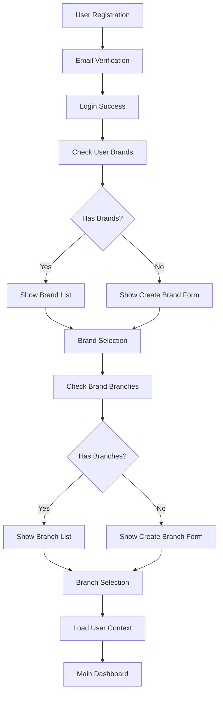
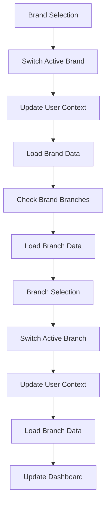
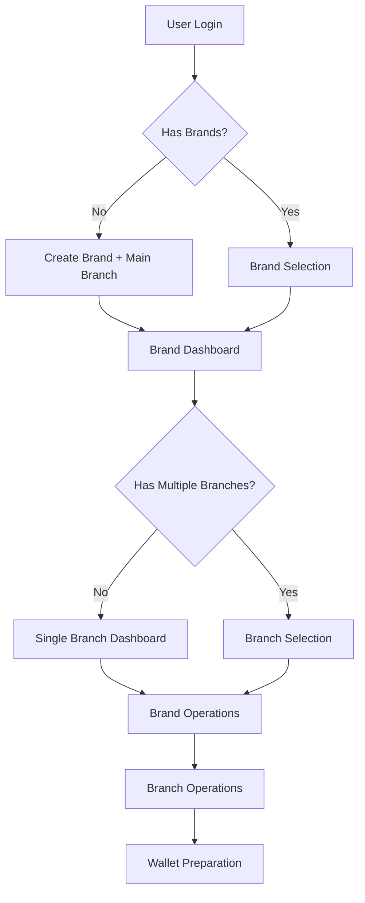

# Mobile Flow & Context Management
# Alur Flow Mobile dan Manajemen Konteks untuk Usago

---

## 📋 **Document Metadata**

| Field | Value |
|-------|-------|
| **Document ID** | DOC-MOBILE-FLOW-CONTEXT |
| **Version** | 1.0 |
| **Status** | Ready to Implement |
| **Category** | Mobile Architecture |
| **Priority** | High |
| **Created Date** | November 13, 2025 |
| **Last Updated** | November 13, 2025 |
| **Next Review** | November 20, 2025 |
| **Author** | Mobile Development Team |
| **Reviewers** | Backend Lead, Frontend Lead, Product Manager |
| **Stakeholders** | Development Team, Product Management |

---

## 🎯 **Purpose**

Dokumen ini mendefinisikan alur flow mobile aplikasi Usago setelah user register dan login, serta manajemen konteks (brand, branch, user role) yang diperlukan untuk mendukung arsitektur Single Brand Multi-Branch dengan **prioritas utama pada Brand & Branch management**.

---

## 🔄 **Complete User Journey Flow**

### **Phase 1: Registration & Initial Login**



### **Phase 2: Brand & Branch Management**



---

## 🏗️ **Context Management Architecture**

### **UserContext Model**

```dart
class UserContext {
  final User user;
  final Brand? activeBrand;
  final Branch? activeBranch;
  final List<Brand> accessibleBrands;
  final List<Branch> accessibleBranches;
  final UserRole role;
  final Map<String, dynamic> permissions;
  final DateTime lastUpdated;

  UserContext({
    required this.user,
    this.activeBrand,
    this.activeBranch,
    required this.accessibleBrands,
    required this.accessibleBranches,
    required this.role,
    required this.permissions,
    required this.lastUpdated,
  });

  UserContext copyWith({
    User? user,
    Brand? activeBrand,
    Branch? activeBranch,
    List<Brand>? accessibleBrands,
    List<Branch>? accessibleBranches,
    UserRole? role,
    Map<String, dynamic>? permissions,
    DateTime? lastUpdated,
  }) {
    return UserContext(
      user: user ?? this.user,
      activeBrand: activeBrand ?? this.activeBrand,
      activeBranch: activeBranch ?? this.activeBranch,
      accessibleBrands: accessibleBrands ?? this.accessibleBrands,
      accessibleBranches: accessibleBranches ?? this.accessibleBranches,
      role: role ?? this.role,
      permissions: permissions ?? this.permissions,
      lastUpdated: lastUpdated ?? DateTime.now(),
    );
  }
}
```

### **Context Manager Implementation**

```dart
class ContextManager {
  static final ContextManager _instance = ContextManager._internal();
  factory ContextManager() => _instance;
  ContextManager._internal();

  UserContext? _context;
  final StreamController<UserContext> _contextController = StreamController<UserContext>.broadcast();

  Stream<UserContext> get contextStream => _contextController.stream;
  UserContext? get currentContext => _context;

  Future<void> initializeContext() async {
    final user = await _getCurrentUser();
    if (user == null) return;

    final brands = await _getUserBrands(user.id);
    final branches = await _getUserBranches(user.id);
    final permissions = await _getUserPermissions(user.id);

    _context = UserContext(
      user: user,
      accessibleBrands: brands,
      accessibleBranches: branches,
      role: user.role,
      permissions: permissions,
      lastUpdated: DateTime.now(),
    );

    _contextController.add(_context!);
  }

  Future<void> switchBrand(Brand brand) async {
    if (_context == null) return;

    final branches = await _getBrandBranches(brand.id);
    final updatedContext = _context!.copyWith(
      activeBrand: brand,
      activeBranch: null,
      accessibleBranches: branches,
    );

    _context = updatedContext;
    _contextController.add(_context);

    // Save to local storage
    await _saveActiveBrand(brand.id);
  }

  Future<void> switchBranch(Branch branch) async {
    if (_context == null) return;

    final permissions = await _getBranchPermissions(branch.id);
    final updatedContext = _context!.copyWith(
      activeBranch: branch,
      permissions: permissions,
    );

    _context = updatedContext;
    _contextController.add(_context);

    // Save to local storage
    await _saveActiveBranch(branch.id);
  }

  Future<void> refreshContext() async {
    await initializeContext();
  }

  void dispose() {
    _contextController.close();
  }
}
```

---

## 📱 **Mobile Implementation Flow**

### **1. Login Success → Navigate to Brand Selection**

```dart
// AuthBloc - Login Success Handler
Future<void> _onLoginSuccess(LoginSuccess event) async {
  // Navigate to brand selection
  context.router.pushNamed('/brand-selection');
}

// Brand Selection Page
class BrandSelectionPage extends StatelessWidget {
  @override
  Widget build(BuildContext context) {
    return BlocBuilder<ContextBloc, ContextState>(
      builder: (context, state) {
        if (state is ContextLoading) {
          return CircularProgressIndicator();
        }

        if (state is ContextLoaded) {
          final userContext = state.context;

          if (userContext.accessibleBrands.isEmpty) {
            // No brands - show create brand form
            return CreateBrandForm();
          } else {
            // Has brands - show brand list
            return BrandListPage(brands: userContext.accessibleBrands);
          }
        }

        return Container();
      },
    );
  }
}
```

### **2. Brand Selection → Branch Management**

```dart
// Brand Selection Handler
Future<void> _onBrandSelected(Brand brand) async {
  // Switch active brand
  await context.read<ContextBloc>().add(SwitchBrandEvent(brand));

  // Navigate to branch selection
  context.router.pushNamed('/branch-selection');
}

// Branch Selection Page
class BranchSelectionPage extends StatelessWidget {
  @override
  Widget build(BuildContext context) {
    return BlocBuilder<ContextBloc, ContextState>(
      builder: (context, state) {
        if (state is ContextLoaded) {
          final userContext = state.context;

          if (userContext.accessibleBranches.isEmpty) {
            // No branches - show create branch form
            return CreateBranchForm(brand: userContext.activeBrand!);
          } else {
            // Has branches - show branch list
            return BranchListPage(branches: userContext.accessibleBranches);
          }
        }

        return Container();
      },
    );
  }
}
```

### **3. Branch Selection → Main Dashboard**

```dart
// Branch Selection Handler
Future<void> _onBranchSelected(Branch branch) async {
  // Switch active branch
  await context.read<ContextBloc>().add(SwitchBranchEvent(branch));

  // Navigate to main dashboard
  context.router.pushNamed('/dashboard');
}

// Main Dashboard Page
class DashboardPage extends StatelessWidget {
  @override
  Widget build(BuildContext context) {
    return BlocBuilder<ContextBloc, ContextState>(
      builder: (context, state) {
        if (state is ContextLoaded) {
          final userContext = state.context;

          return DashboardContent(
            user: userContext.user,
            activeBrand: userContext.activeBrand,
            activeBranch: userContext.activeBranch,
            role: userContext.role,
            permissions: userContext.permissions,
          );
        }

        return Container();
      },
    );
  }
}

// Dashboard Content Widget
class DashboardContent extends StatelessWidget {
  final User user;
  final Brand? activeBrand;
  final Branch? activeBranch;
  final UserRole role;
  final Map<String, dynamic> permissions;

  const DashboardContent({
    Key? key,
    required this.user,
    this.activeBrand,
    this.activeBranch,
    required this.role,
    required this.permissions,
  }) : super(key: key);

  @override
  Widget build(BuildContext context) {
    return Scaffold(
      appBar: AppBar(
        title: Text(activeBrand?.name ?? 'Usago'),
        actions: [
          BrandSelector(),
          BranchSelector(),
          UserProfileButton(),
        ],
      ),
      body: Column(
        children: [
          // Show features based on user role and permissions
          if (permissions['can_view_analytics'] == true)
            AnalyticsSection(),
          if (permissions['can_manage_wallets'] == true)
            WalletSection(),
          if (permissions['can_manage_invoices'] == true)
            InvoiceSection(),
          if (permissions['can_manage_customers'] == true)
            CustomerSection(),
        ],
      ),
    );
  }
}
```

---

## 🔐 **Security Flow Implementation**

### **Every API Call Includes:**

```dart
class SecureApiClient {
  final Dio _dio;
  final ContextManager _contextManager;

  SecureApiClient(this._dio, this._contextManager);

  Future<Map<String, dynamic>> get(String path) async {
    final context = _contextManager.currentContext;
    if (context == null) throw Exception('No context available');

    final options = Options(
      headers: {
        'Authorization': 'Bearer ${await _getAuthToken()}',
        'X-Active-Brand-ID': context!.activeBrand?.id ?? '',
        'X-Active-Branch-ID': context!.activeBranch?.id ?? '',
        'X-User-Role': context!.role.name,
        'Content-Type': 'application/json',
      },
    );

    try {
      final response = await _dio.get(path, options: options);
      return response.data;
    } on DioException catch (e) {
      throw _handleApiError(e);
    }
  }

  Future<Map<String, dynamic>> post(String path, dynamic data) async {
    final context = _contextManager.currentContext;
    if (context == null) throw Exception('No context available');

    final options = Options(
      headers: {
        'Authorization': 'Bearer ${await _getAuthToken()}',
        'X-Active-Brand-ID': context!.activeBrand?.id ?? '',
        'X-Active-Branch-ID': context!.activeBranch?.id ?? '',
        'X-User-Role': context!.role.name,
        'Content-Type': 'application/json',
      },
    );

    try {
      final response = await _dio.post(path, data: data, options: options);
      return response.data;
    } on DioException catch (e) {
      throw _handleApiError(e);
    }
  }

  Future<String> _getAuthToken() async {
    final prefs = await SharedPreferences.getInstance();
    return prefs.getString(StorageConstants.bearerTokenKey) ?? '';
  }

  Exception _handleApiError(DioException e) {
    if (e.response?.statusCode == 401) {
      // Token expired - trigger refresh
      return AuthenticationException('Token expired');
    } else if (e.response?.statusCode == 403) {
      // Permission denied
      return AuthorizationException('Access denied');
    } else {
      return ApiException(e.message ?? 'Unknown error');
    }
  }
}
```

### **Server-Side Validation:**

```typescript
// Middleware for server-side validation
export const contextValidationMiddleware = async (request: FastifyRequest, reply: FastifyReply) => {
  const authToken = request.headers.authorization;
  const activeBrandId = request.headers['x-active-brand-id'];
  const activeBranchId = request.headers['x-active-branch-id'];
  const userRole = request.headers['x-user-role'];

  // Validate token
  if (!authToken || !authToken.startsWith('Bearer ')) {
    return reply.status(401).send({
      success: false,
      error: 'Invalid or missing authentication token',
      code: 'INVALID_TOKEN'
    });
  }

  // Validate brand access
  if (activeBrandId && !await hasBrandAccess(request.user.id, activeBrandId)) {
    return reply.status(403).send({
      success: false,
      error: 'Access denied for brand',
      code: 'BRAND_ACCESS_DENIED'
    });
  }

  // Validate branch access
  if (activeBranchId && !await hasBranchAccess(request.user.id, activeBranchId)) {
    return reply.status(403).send({
      success: false,
      error: 'Access denied for branch',
      code: 'BRANCH_ACCESS_DENIED'
    });
  }

  // Validate role permissions
  if (userRole && !await hasRolePermission(request.user.id, userRole, request.routeOptions.url)) {
    return reply.status(403).send({
      success: false,
      error: 'Insufficient permissions',
      code: 'INSUFFICIENT_PERMISSIONS'
    });
  }

  // Add context to request object
  request.userContext = {
    activeBrandId,
    activeBranchId,
    userRole
  };
};
```

---

## 📱 **UI Components for Context Management**

### **Brand Selector Widget**

```dart
class BrandSelector extends StatelessWidget {
  @override
  Widget build(BuildContext context) {
    return BlocBuilder<ContextBloc, ContextState>(
      builder: (context, state) {
        if (state is ContextLoaded) {
          final userContext = state.context;
          final brands = userContext.accessibleBrands;
          final activeBrand = userContext.activeBrand;

          return PopupMenuButton(
            child: Row(
              children: [
                Text(activeBrand?.name ?? 'Select Brand'),
                Icon(Icons.arrow_drop_down),
              ],
            ),
            itemBuilder: (context) {
              return brands.map((brand) {
                return PopupMenuItem(
                  value: brand,
                  child: Text(brand.name),
                  onTap: () => _selectBrand(context, brand),
                );
              }).toList();
            },
          );
        }

        return Container();
      },
    );
  }

  void _selectBrand(BuildContext context, Brand brand) {
    context.read<ContextBloc>().add(SwitchBrandEvent(brand));
  }
}
```

### **Branch Selector Widget**

```dart
class BranchSelector extends StatelessWidget {
  @override
  Widget build(BuildContext context) {
    return BlocBuilder<ContextBloc, ContextState>(
      builder: (context, state) {
        if (state is ContextLoaded) {
          final userContext = state.context;
          final branches = userContext.accessibleBranches;
          final activeBranch = userContext.activeBranch;

          return PopupMenuButton(
            child: Row(
              children: [
                Text(activeBranch?.name ?? 'Select Branch'),
                Icon(Icons.arrow_drop_down),
              ],
            ),
            itemBuilder: (context) {
              return branches.map((branch) {
                return PopupMenuItem(
                  value: branch,
                  child: Text(branch.name),
                  onTap: () => _selectBranch(context, branch),
                );
              }).toList();
            },
          );
        }

        return Container();
      },
    );
  }

  void _selectBranch(BuildContext context, Branch branch) {
    context.read<ContextBloc>().add(SwitchBranchEvent(branch));
  }
}
```

---

## 🔄 **State Management Integration**

### **Context Bloc Implementation**

```dart
class ContextBloc extends Bloc<ContextEvent, ContextState> {
  final ContextManager _contextManager;

  ContextBloc(this._contextManager) : super(ContextInitial()) {
    on<LoadContextEvent>(_onLoadContext);
    on<SwitchBrandEvent>(_onSwitchBrand);
    on<SwitchBranchEvent>(_onSwitchBranch);
    on<RefreshContextEvent>(_onRefreshContext);
  }

  Future<void> _onLoadContext(LoadContextEvent event, Emitter<ContextState> emit) async {
    emit(ContextLoading());
    await _contextManager.initializeContext();
    emit(ContextLoaded(context: _contextManager.currentContext!));
  }

  Future<void> _onSwitchBrand(SwitchBrandEvent event, Emitter<ContextState> emit) async {
    await _contextManager.switchBrand(event.brand);
    emit(ContextLoaded(context: _contextManager.currentContext!));
  }

  Future<void> _onSwitchBranch(SwitchBranchEvent event, Emitter<ContextState> emit) async {
    await _contextManager.switchBranch(event.branch);
    emit(ContextLoaded(context: _contextManager.currentContext!));
  }

  Future<void> _onRefreshContext(RefreshContextEvent event, Emitter<ContextState> emit) async {
    emit(ContextLoading());
    await _contextManager.refreshContext();
    emit(ContextLoaded(context: _contextManager.currentContext!));
  }
}
```

---

## 📋 **Implementation Checklist**

### **Phase 1: Basic Context Management**
- [ ] **UserContext Model**: Implement UserContext class dengan semua properti yang diperlukan
- [ ] **ContextManager**: Implement ContextManager untuk manajemen state global
- [ ] **ContextBloc**: Implement BLoC untuk state management context
- [ ] **Local Storage**: Implement penyimpanan context ke local storage
- [ ] **Basic Flow**: Implement flow login → brand → branch → dashboard

### **Phase 2: Advanced Features**
- [ ] **Brand Switching**: Implement brand switching dengan proper validation
- [ ] **Branch Switching**: Implement branch switching dengan permission update
- [ ] **Permission System**: Implement permission checking untuk setiap action
- [ ] **Cache Management**: Implement cache untuk brands dan branches data
- [ ] **Offline Support**: Implement offline mode dengan data synchronization

### **Phase 3: Security & Optimization**
- [ ] **Secure API Client**: Implement API client dengan context headers
- [ ] **Token Refresh**: Implement automatic token refresh
- [ ] **Error Handling**: Implement comprehensive error handling
- [ ] **Performance Optimization**: Optimize context loading dan switching
- [ ] **Testing**: Implement unit dan integration tests

---

## 🔗 **Related Documentation**

- [`01-API-Endpoints-Structure.md`](01-API-Endpoints-Structure.md) - API Endpoints Structure
- [`../core/di/injection_container.dart`](../core/di/injection_container.dart) - Dependency Injection
- [`../core/network/dio_client.dart`](../core/network/dio_client.dart) - HTTP Client Implementation
- [`../features/auth/presentation/bloc/auth_bloc.dart`](../features/auth/presentation/bloc/auth_bloc.dart) - Authentication BLoC
- [`../../../docs/08-Authentication-Architecture/04-Permission-System.md`](../../../docs/08-Authentication-Architecture/04-Permission-System.md) - Permission System

---

## 📞 **Contact Information**

### **Development Team**

| Role | Name | Contact |
|-------|-------|----------|
| **Mobile Lead** | [Name] | [Email] |
| **Backend Lead** | [Name] | [Email] |
| **Product Manager** | [Name] | [Email] |

### **Support**

| Issue | Contact | Response Time |
|-------|----------|---------------|
| **Context Management Issue** | [Name] | 2 hours |
| **Flow Problem** | [Name] | 4 hours |
| **Security Issue** | [Name] | 1 hour |

---

## 📝 **Notes**

## 🎯 **Updated Priority Implementation (Brand & Branch Focus)**

### **Phase 1: Brand Management (Priority #1) 🏢**
- **Brand Creation**: Setup new brand dengan automatic main branch creation
- **Brand Selection**: Multi-brand user support dengan fast switching
- **Brand Ownership**: Complete ownership transfer dan invitation system
- **Brand Switching**: Context switching antar brands < 1 second

### **Phase 2: Branch Management (Priority #2) 🏪**
- **Branch Creation**: Multi-branch setup dengan hierarchy management
- **Branch Selection**: Quick switching antar branches dalam brand
- **Branch User Roles**: Role-based access control dengan permissions
- **Branch Operations**: Daily business operations per branch

### **Phase 3: Wallet Preparation (Priority #3) 💳**
- **Wallet Infrastructure**: Multi-wallet setup untuk Indonesian SMEs
- **Basic Transactions**: Simple inflow/outflow operations
- **Integration Ready**: Prepare untuk advanced features

### **Updated Implementation Flow**


### **Current Status (November 13, 2025)**
- ✅ **Flow Defined**: Complete user journey flow telah didefinisikan
- ✅ **Context Architecture**: UserContext dan ContextManager telah dirancang
- ✅ **Security Flow**: Secure API client dengan context headers telah dirancang
- ✅ **UI Components**: Brand dan branch selector widgets telah dirancang
- ✅ **Brand & Branch Priority**: Implementation focus telah didefinisikan
- ✅ **Wallet Preparation**: Infrastructure setup untuk wallet telah dirancang
- 🔄 **Implementation**: Perlu implementasi di codebase mobile
- 🔄 **Integration**: Perlu integrasi dengan existing auth system

### **Key Decisions**
1. **Context-First Approach**: Semua API calls harus menyertakan context information
2. **State Management**: Menggunakan BLoC pattern untuk consistency dengan existing codebase
3. **Security Headers**: Brand ID, Branch ID, dan User Role dikirim di setiap request
4. **Local Storage**: Context disimpan secara lokal untuk offline capability
5. **Error Handling**: Comprehensive error handling dengan proper user feedback

### **Next Steps**
1. Implementasikan UserContext dan ContextManager classes
2. Integrasikan dengan existing authentication system
3. Implementasikan ContextBloc dan state management
4. Buat UI components untuk brand dan branch selection
5. Test complete flow dari login hingga dashboard
6. Implementasikan security measures dan error handling

---

**Document End**

**Go Digital, Grow Together.**