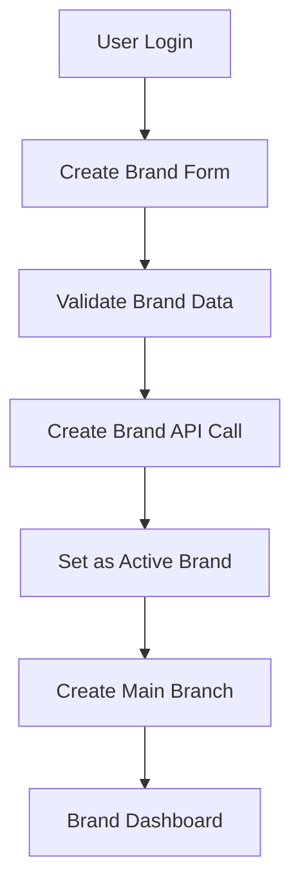
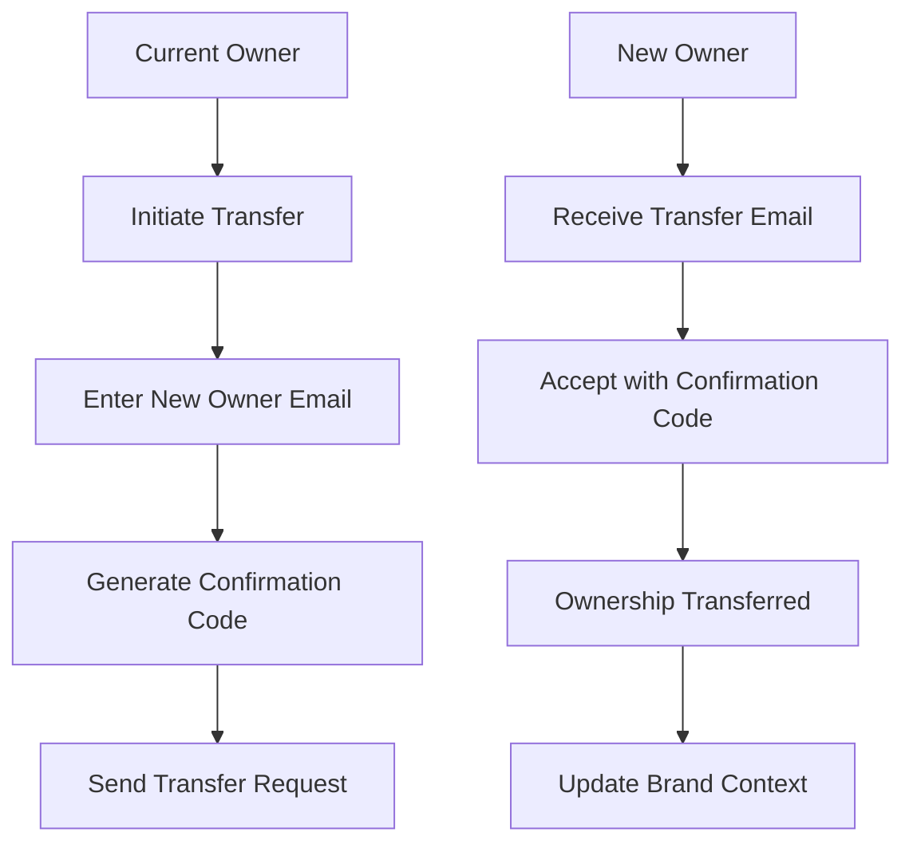
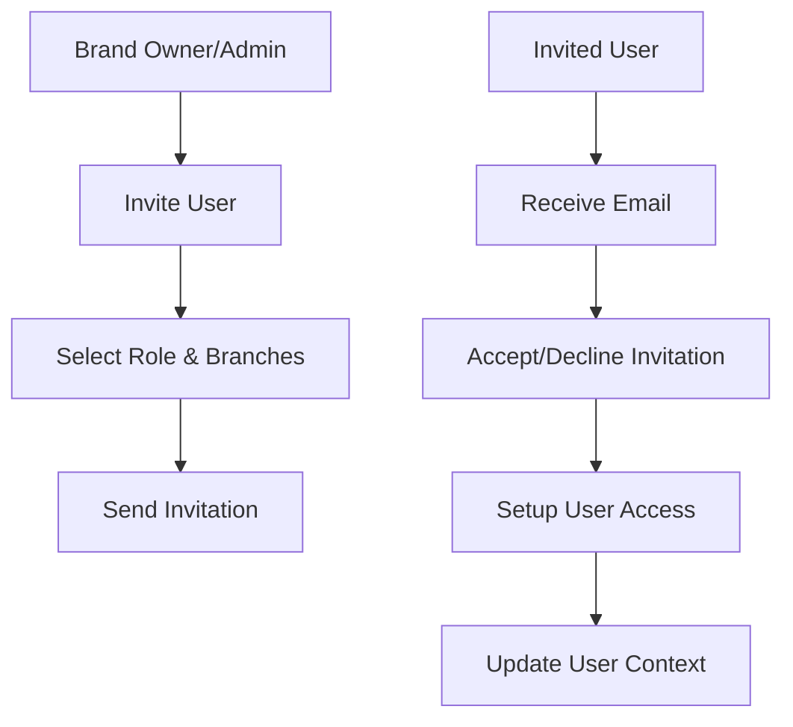
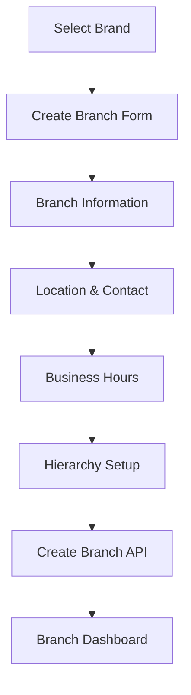
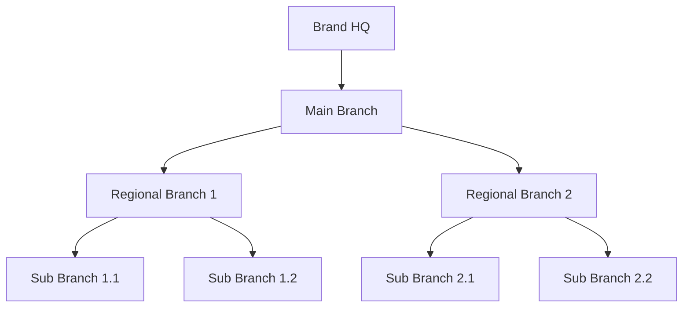
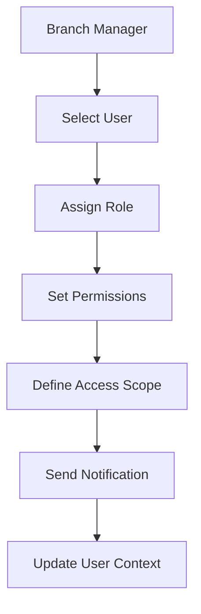
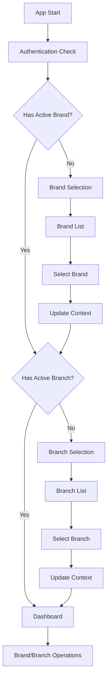

# 🏢 Brand & Branch Focused Implementation Guide
## Dengan Persiapan Wallet Integration

## 📋 Overview

Dokumentasi ini berfokus pada implementasi **Brand** dan **Branch** sebagai prioritas utama, dengan persiapan infrastruktur untuk **Wallet** integration di fase berikutnya. Pendekatan ini mengikuti prinsip **Single Brand Multi-Branch Architecture** yang telah didefinisikan dalam project Usago.

## 🎯 Priority Implementation Order

### Phase 1: Brand Management (Priority #1)
- **Brand Creation & Management**
- **Brand Ownership & Transfer**
- **Brand Invitation System**
- **Brand Switching**

### Phase 2: Branch Management (Priority #2)
- **Branch Creation & Hierarchy**
- **Branch User Role Management**
- **Branch Switching**
- **Branch Statistics**

### Phase 3: Wallet Preparation (Priority #3)
- **Wallet Infrastructure Setup**
- **Basic Transaction Types**
- **Multi-Wallet Support**
- **Integration Ready State**

---

## 🏢 Phase 1: Brand Management Implementation

### 1.1 Brand Core Features

#### Brand Creation Flow


#### Required API Endpoints
```typescript
// Brand Core Operations
POST   /api/brands                    // Create new brand
GET    /api/brands/user               // Get user's owned brands
GET    /api/brands/accessible         // Get accessible brands
GET    /api/brands/:id                // Get brand by ID
PUT    /api/brands/:id                // Update brand
DELETE /api/brands/:id                // Delete brand (soft delete)

// Brand Management
POST   /api/brands/switch             // Switch active brand
POST   /api/brands/:id/transfer       // Transfer ownership
GET    /api/brands/:id/stats          // Get brand statistics

// Brand Invitations
POST   /api/brands/:id/invite         // Invite user to brand
POST   /api/invitations/accept        // Accept invitation
POST   /api/invitations/:id/decline   // Decline invitation
GET    /api/brands/:id/invitations     // Get brand invitations
```

#### Brand Data Models
```typescript
// Brand Creation Request
interface CreateBrandRequest {
  name: string;                    // Brand name (1-100 chars)
  slug: string;                    // URL-friendly slug
  businessType: 'SERVICE' | 'RETAIL' | 'MANUFACTURING' | 'OTHER';
  industry?: string;                // Industry category
  description?: string;             // Brand description
  logoUrl?: string;                // Brand logo URL
  businessAddress?: string;         // Physical address
  timezone: string;                // Default: Asia/Jakarta
  currency: string;                // Default: IDR
}

// Brand Response
interface BrandResponse {
  id: string;
  name: string;
  slug: string;
  ownerId: string;
  logoUrl: string | null;
  businessType: string;
  industry: string | null;
  description: string | null;
  settings: Record<string, any>;
  timezone: string;
  currency: string;
  subscriptionTier: string;
  subscriptionStatus: string;
  createdAt: Date;
  updatedAt: Date;
}
```

### 1.2 Brand Ownership & Transfer

#### Ownership Transfer Flow


#### Transfer Implementation
```typescript
// Transfer Request
interface TransferBrandRequest {
  newOwnerId: string;
  confirmationCode: string;
}

// Mobile Implementation Example
class BrandTransferService {
  async initiateTransfer(brandId: string, newOwnerEmail: string) {
    // 1. Validate current ownership
    // 2. Generate confirmation code
    // 3. Send transfer invitation
    // 4. Update transfer status
  }

  async confirmTransfer(brandId: string, confirmationCode: string) {
    // 1. Validate confirmation code
    // 2. Update ownership
    // 3. Notify both parties
    // 4. Update user context
  }
}
```

### 1.3 Brand Invitation System

#### Invitation Flow


#### Role Definitions
```typescript
enum BrandRole {
  BRAND_OWNER = 'BRAND_OWNER',           // Full control
  BRAND_ADMIN = 'BRAND_ADMIN',           // Brand-level management
  BRANCH_MANAGER = 'BRANCH_MANAGER',     // Branch management
  BRANCH_ADMIN = 'BRANCH_ADMIN',         // Branch administration
  BRANCH_STAFF = 'BRANCH_STAFF',         // Branch operations
  CROSS_BRANCH_VIEWER = 'CROSS_BRANCH_VIEWER' // Read-only across branches
}

// Invitation Request
interface InviteUserRequest {
  email: string;
  role: BrandRole;
  branchIds?: string[];                 // Specific branches access
  message?: string;                     // Personal message
}
```

---

## 🏪 Phase 2: Branch Management Implementation

### 2.1 Branch Core Features

#### Branch Creation Flow


#### Required API Endpoints
```typescript
// Branch Core Operations
POST   /api/branches                   // Create new branch
GET    /api/branches/user              // Get user's accessible branches
GET    /api/branches/:id               // Get branch by ID
PUT    /api/branches/:id               // Update branch
DELETE /api/branches/:id               // Delete branch (soft delete)

// Branch Management
POST   /api/branches/switch            // Switch active branch
GET    /api/branches/hierarchy         // Get branch hierarchy
PUT    /api/branches/:id/hierarchy     // Update branch hierarchy
GET    /api/branches/:id/stats         // Get branch statistics

// Branch User Management
GET    /api/branches/:id/users         // Get branch user roles
POST   /api/branches/:id/users         // Assign user to branch
PUT    /api/branches/users/:roleId     // Update user branch role
DELETE /api/branches/users/:roleId     // Remove user branch role
```

#### Branch Data Models
```typescript
// Branch Creation Request
interface CreateBranchRequest {
  name: string;                        // Branch name (1-100 chars)
  slug: string;                        // URL-friendly slug
  brandId: string;                     // Parent brand ID
  address?: string;                    // Physical address
  phone?: string;                      // Contact phone
  email?: string;                      // Contact email
  isMainBranch: boolean;               // Main branch flag
  parentBranchId?: string;             // Parent branch for hierarchy
  settings?: Record<string, any>;       // Branch-specific settings
  timezone: string;                    // Default: Asia/Jakarta
  currency: string;                    // Default: IDR
  businessHours?: Record<string, any>;  // Operating hours
  latitude?: number;                   // GPS coordinates
  longitude?: number;                  // GPS coordinates
}

// Branch Response
interface BranchResponse {
  id: string;
  name: string;
  slug: string;
  brandId: string;
  address: string | null;
  phone: string | null;
  email: string | null;
  isMainBranch: boolean;
  parentBranchId: string | null;
  settings: Record<string, any>;
  timezone: string;
  currency: string;
  businessHours: Record<string, any> | null;
  latitude: number | null;
  longitude: number | null;
  createdAt: Date;
  updatedAt: Date;
}
```

### 2.2 Branch Hierarchy Management

#### Hierarchy Structure


#### Hierarchy Implementation
```typescript
// Hierarchy Management
interface BranchHierarchy {
  branchId: string;
  parentBranchId?: string;
  children?: string[];
}

class BranchHierarchyService {
  async updateHierarchy(branchId: string, parentBranchId?: string) {
    // 1. Validate hierarchy rules
    // 2. Update parent-child relationships
    // 3. Update user permissions
    // 4. Refresh context cache
  }

  async getBranchHierarchy(brandId: string) {
    // 1. Build tree structure
    // 2. Include user permissions
    // 3. Return hierarchical data
  }
}
```

### 2.3 Branch User Role Management

#### Role Assignment Flow


#### Branch Roles Implementation
```typescript
// Branch Role Assignment
interface CreateBranchRoleRequest {
  userId: string;
  branchId: string;
  role: 'BRANCH_MANAGER' | 'BRANCH_ADMIN' | 'BRANCH_STAFF';
  permissions?: string[];
  expiresAt?: Date;
}

// Branch User Role Response
interface BranchUserRoleResponse {
  id: string;
  userId: string;
  branchId: string;
  role: string;
  permissions: string[];
  expiresAt: Date | null;
  createdAt: Date;
  updatedAt: Date;
}
```

---

## 💳 Phase 3: Wallet Preparation (Infrastructure Setup)

### 3.1 Wallet Infrastructure

#### Wallet Types for Indonesian SMEs
```typescript
enum WalletType {
  OPERATIONAL = 'OPERATIONAL',    // Dana operasional harian
  SAVINGS = 'SAVINGS',           // Dana tabungan/jangka panjang
  PROJECT = 'PROJECT',            // Dana untuk project spesifik
  COMMUNITY = 'COMMUNITY',        // Dana komunitas/RT
  PERSONAL = 'PERSONAL',          // Dana pribadi owner
  CUSTOMER = 'CUSTOMER',          // Deposit/customer
  SUPPLIER = 'SUPPLIER',          // Pembayaran ke supplier
  ESCROW = 'ESCROW'               // Dana escrow/transaksi aman
}
```

#### Wallet Data Models
```typescript
// Wallet Creation Request
interface CreateWalletRequest {
  name: string;                    // Wallet name (1-100 chars)
  type: WalletType;                // Wallet type
  description?: string;             // Wallet description
  initialBalance: number;           // Starting balance (>= 0)
  currency: string;                // Default: IDR
  brandId: string;                 // Parent brand ID
  branchId: string;                // Parent branch ID
  settings?: Record<string, any>;  // Wallet-specific settings
  isActive: boolean;                // Wallet status
}

// Wallet Response
interface WalletResponse {
  id: string;
  name: string;
  type: string;
  description: string | null;
  balance: number;
  availableBalance: number;        // Balance minus pending transactions
  currency: string;
  brandId: string;
  branchId: string;
  settings: Record<string, any>;
  isActive: boolean;
  createdAt: Date;
  updatedAt: Date;
}
```

### 3.2 Transaction Infrastructure

#### Transaction Types
```typescript
enum TransactionType {
  INFLOW = 'INFLOW',              // Uang masuk
  OUTFLOW = 'OUTFLOW'              // Uang keluar
}

enum TransactionCategory {
  // Inflow Categories
  SALES = 'SALES',
  LOAN = 'LOAN',
  INVESTMENT = 'INVESTMENT',
  GIFT = 'GIFT',
  REFUND = 'REFUND',
  OTHER_IN = 'OTHER_IN',

  // Outflow Categories
  OPERATIONAL = 'OPERATIONAL',
  SALARY = 'SALARY',
  SUPPLIER_PAYMENT = 'SUPPLIER_PAYMENT',
  INVESTMENT_OUT = 'INVESTMENT_OUT',
  TAX = 'TAX',
  EXPENSE = 'EXPENSE',
  OTHER_OUT = 'OTHER_OUT'
}

enum TransactionStatus {
  PENDING = 'PENDING',
  COMPLETED = 'COMPLETED',
  FAILED = 'FAILED',
  CANCELLED = 'CANCELLED'
}
```

#### Transaction Data Models
```typescript
// Transaction Creation Request
interface CreateTransactionRequest {
  walletId: string;                // Target wallet ID
  type: TransactionType;            // Transaction type
  category: TransactionCategory;     // Transaction category
  amount: number;                   // Positive amount
  description?: string;             // Transaction description
  reference?: string;               // Invoice number, booking ID, etc.
  receiptUrl?: string;              // Receipt image URL
  metadata?: Record<string, any>;   // Additional metadata
  brandId: string;                  // Transaction brand
  branchId: string;                 // Transaction branch
  userId: string;                   // Transaction user
}
```

### 3.3 Wallet API Endpoints (Preparation)

#### Core Wallet Operations
```typescript
// Wallet Management
POST   /api/wallets                 // Create new wallet
GET    /api/wallets                 // Get user's accessible wallets
GET    /api/wallets/:id             // Get wallet by ID
PUT    /api/wallets/:id             // Update wallet
DELETE /api/wallets/:id             // Delete wallet (soft delete)

// Wallet Operations
GET    /api/wallets/:id/balance     // Get wallet balance
POST   /api/wallets/:id/transactions // Create transaction
GET    /api/wallets/:id/transactions // Get wallet transactions
PUT    /api/transactions/:id        // Update transaction
POST   /api/wallets/transfer         // Transfer between wallets
GET    /api/wallets/:id/stats       // Get wallet statistics
```

---

## 📱 Mobile Implementation Strategy

### 4.1 Context Management Integration

#### Enhanced UserContext
```typescript
interface UserContext {
  // User Information
  user: {
    id: string;
    email: string;
    name: string;
    role: string;
  };

  // Brand Context
  activeBrand: {
    id: string;
    name: string;
    slug: string;
    role: string;                    // User's role in this brand
    permissions: string[];           // Brand-level permissions
  };

  // Branch Context
  activeBranch: {
    id: string;
    name: string;
    slug: string;
    role: string;                    // User's role in this branch
    permissions: string[];           // Branch-level permissions
    isMainBranch: boolean;
  };

  // Wallet Context (Preparation)
  accessibleWallets: {
    id: string;
    name: string;
    type: string;
    balance: number;
    permissions: string[];           // WALLET_READ, WALLET_WRITE, etc.
  }[];

  // Application State
  isOnline: boolean;
  lastSync: Date;
  appVersion: string;
}
```

### 4.2 Brand & Branch Navigation Flow

#### Navigation Structure


### 4.3 Mobile UI Components

#### Brand Selection Component
```typescript
// Brand Selection Screen
class BrandSelectionScreen extends StatelessWidget {
  @override
  Widget build(BuildContext context) {
    return BlocBuilder<AuthBloc, AuthState>(
      builder: (context, state) {
        return Scaffold(
          appBar: AppBar(title: Text('Pilih Brand')),
          body: ListView.builder(
            itemCount: state.accessibleBrands.length,
            itemBuilder: (context, index) {
              final brand = state.accessibleBrands[index];
              return BrandCard(
                brand: brand,
                onTap: () => _selectBrand(context, brand),
              );
            },
          ),
          floatingActionButton: FloatingActionButton(
            onPressed: () => _createNewBrand(context),
            child: Icon(Icons.add),
          ),
        );
      },
    );
  }
}
```

#### Branch Selection Component
```typescript
// Branch Selection Screen
class BranchSelectionScreen extends StatelessWidget {
  @override
  Widget build(BuildContext context) {
    return BlocBuilder<AuthBloc, AuthState>(
      builder: (context, state) {
        return Scaffold(
          appBar: AppBar(title: Text('Pilih Cabang')),
          body: ListView.builder(
            itemCount: state.accessibleBranches.length,
            itemBuilder: (context, index) {
              final branch = state.accessibleBranches[index];
              return BranchCard(
                branch: branch,
                onTap: () => _selectBranch(context, branch),
              );
            },
          ),
          floatingActionButton: FloatingActionButton(
            onPressed: () => _createNewBranch(context),
            child: Icon(Icons.add),
          ),
        );
      },
    );
  }
}
```

---

## 🔧 Implementation Checklist

### Phase 1: Brand Management ✅
- [ ] **Brand Creation & Management**
  - [ ] Brand creation form with validation
  - [ ] Brand list and search functionality
  - [ ] Brand editing capabilities
  - [ ] Brand deletion (soft delete)

- [ ] **Brand Ownership & Transfer**
  - [ ] Ownership transfer interface
  - [ ] Confirmation code generation
  - [ ] Transfer acceptance flow
  - [ ] Ownership history tracking

- [ ] **Brand Invitation System**
  - [ ] User invitation interface
  - [ ] Role selection and assignment
  - [ ] Invitation acceptance/decline
  - [ ] Invitation status tracking

- [ ] **Brand Switching**
  - [ ] Brand selection screen
  - [ ] Context switching logic
  - [ ] Brand-specific data loading
  - [ ] UI state management

### Phase 2: Branch Management ✅
- [ ] **Branch Creation & Hierarchy**
  - [ ] Branch creation form
  - [ ] Hierarchy setup interface
  - [ ] Parent-child relationship management
  - [ ] Branch tree visualization

- [ ] **Branch User Role Management**
  - [ ] User assignment to branches
  - [ ] Role-based permission system
  - [ ] Branch-specific access control
  - [ ] User role history tracking

- [ ] **Branch Switching**
  - [ ] Branch selection screen
  - [ ] Context switching logic
  - [ ] Branch-specific data loading
  - [ ] UI state management

- [ ] **Branch Statistics**
  - [ ] Branch performance metrics
  - [ ] User activity tracking
  - [ ] Financial summaries
  - [ ] Analytics dashboard

### Phase 3: Wallet Preparation 🔄
- [ ] **Wallet Infrastructure**
  - [ ] Wallet creation interface
  - [ ] Wallet type selection
  - [ ] Multi-wallet management
  - [ ] Wallet balance tracking

- [ ] **Transaction Infrastructure**
  - [ ] Transaction creation interface
  - [ ] Transaction categorization
  - [ ] Receipt upload functionality
  - [ ] Transaction history

- [ ] **Integration Preparation**
  - [ ] API endpoint integration
  - [ ] Data synchronization
  - [ ] Offline mode support
  - [ ] Error handling

---

## 🎯 Success Metrics

### Phase 1: Brand Management
- **Brand Creation**: < 2 minutes per brand
- **Brand Switching**: < 1 second
- **Invitation Acceptance**: < 24 hours average
- **User Satisfaction**: > 4.5/5 rating

### Phase 2: Branch Management
- **Branch Creation**: < 3 minutes per branch
- **Branch Switching**: < 1 second
- **Role Assignment**: < 30 seconds per user
- **Hierarchy Setup**: < 5 minutes for 10 branches

### Phase 3: Wallet Preparation
- **Wallet Creation**: < 1 minute per wallet
- **Transaction Recording**: < 30 seconds
- **Balance Sync**: < 2 seconds
- **Data Accuracy**: 99.9% uptime

---

## 📚 References

### API Documentation
- [Brand API Endpoints](./01-API-Endpoints-Structure.md#brand-management)
- [Branch API Endpoints](./01-API-Endpoints-Structure.md#branch-management)
- [Wallet API Endpoints](./01-API-Endpoints-Structure.md#wallet-management)

### Mobile Documentation
- [Mobile Flow & Context Management](./02-Mobile-Flow-Context-Management.md)
- [Authentication Implementation](../task/better_auth_integration.md)
- [Architecture Rules](../development/architecture_rules.md)

### Server Documentation
- [Brand Schema](../../../apps/server/src/features/brand/brand.schema.ts)
- [Branch Schema](../../../apps/server/src/features/branch/branch.schema.ts)
- [Wallet Schema](../../../apps/server/src/features/wallet/wallet.schema.ts)

---

## 🔄 Next Steps

1. **Implement Phase 1**: Brand Management features
2. **Implement Phase 2**: Branch Management features
3. **Prepare Phase 3**: Wallet infrastructure setup
4. **Integration Testing**: End-to-end flow validation
5. **User Testing**: Real-world feedback collection
6. **Performance Optimization**: Based on usage patterns

---

*Dokumentasi ini akan terus diupdate seiring dengan perkembangan implementasi Brand & Branch features di aplikasi mobile Usago.*