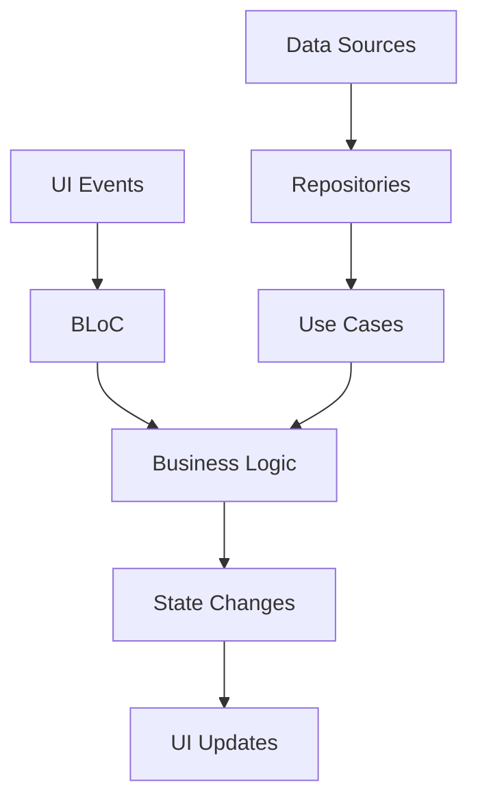

# BLoC Implementation Guide

---

## 📋 **Document Metadata**

| Field | Value |
|-------|-------|
| **Document ID** | DOC-ARCHITECTURE-BLOC-GUIDE |
| **Version** | 1.0.0 |
| **Status** | Ready for Implementation |
| **Category** | Architecture Guide |
| **Priority** | High |
| **Created Date** | November 23, 2025 |
| **Last Updated** | November 23, 2025 |
| **Next Review** | December 23, 2025 |
| **Author** | Mobile Development Team |
| **Reviewers** | Tech Lead, Architecture Team |
| **Stakeholders** | Development Team, Product Management |

---

## 🎯 **Purpose**

Dokumen ini menyediakan panduan komprehensif untuk implementasi BLoC (Business Logic Component) pattern pada aplikasi mobile Usago, berdasarkan implementasi yang sudah ada dan best practices yang telah terbukti efektif.

---

## Executive Summary

BLoC pattern telah diimplementasikan secara konsisten pada aplikasi mobile Usago dengan fokus pada separation of concerns, testability, dan maintainability. Panduan ini mendokumentasikan pattern yang digunakan, best practices, dan implementasi spesifik untuk setiap fitur.

## 1. BLoC Pattern Overview

### 1.1 Konsep Dasar

BLoC (Business Logic Component) adalah pattern yang memisahkan business logic dari UI layer menggunakan streams untuk mengelola state.



### 1.2 Komponen BLoC

1. **Events**: Aksi yang terjadi di UI
2. **States**: Representasi dari UI state
3. **BLoC**: Meng-handle events dan menghasilkan states
4. **Repository**: Sumber data untuk BLoC

## 2. Implementation Pattern

### 2.1 Standard BLoC Structure

Setiap BLoC mengikuti struktur berikut:

```dart
// File: presentation/bloc/[feature]_[purpose]_[feature]_[purpose]_bloc.dart
class [Feature][Purpose]Bloc extends Bloc<[Feature][Purpose]Event, [Feature][Purpose]State> {
  final [UseCase] _useCase;
  final AppLogger _logger;

  [Feature][Purpose]Bloc({
    required [UseCase] useCase,
    required AppLogger logger,
  }) : _useCase = useCase,
       _logger = logger,
       super(const [Feature][Purpose]Initial()) {
    on<Load[Feature][Purpose]Event>(_onLoad[Feature][Purpose]);
    on<Create[Feature][Purpose]Event>(_onCreate[Feature][Purpose]);
    on<Update[Feature][Purpose]Event>(_onUpdate[Feature][Purpose]);
    on<Delete[Feature][Purpose]Event>(_onDelete[Feature][Purpose]);
  }

  Future<void> _onLoad[Feature][Purpose](
    Load[Feature][Purpose]Event event,
    Emitter<[Feature][Purpose]State> emit,
  ) async {
    emit(const [Feature][Purpose]Loading());

    final result = await _useCase([Feature][Purpose]Params(id: event.id));

    result.fold(
      (failure) {
        _logger.error('Failed to load [feature] [purpose]: $failure');
        emit([Feature][Purpose]Error(message: failure.message));
      },
      (data) {
        _logger.info('Successfully loaded [feature] [purpose]: ${data.id}');
        emit([Feature][Purpose]Loaded(data: data));
      },
    );
  }
}
```

### 2.2 Event Pattern

```dart
// File: presentation/bloc/[feature]_[purpose]/[feature]_[purpose]_event.dart
abstract class [Feature][Purpose]Event extends Equatable {
  const [Feature][Purpose]Event();
}

class Load[Feature][Purpose]Event extends [Feature][Purpose]Event {
  final String id;

  const Load[Feature][Purpose]Event({required this.id});

  @override
  List<Object?> get props => [id];
}

class Create[Feature][Purpose]Event extends [Feature][Purpose]Event {
  final [Feature][Purpose]Data data;

  const Create[Feature][Purpose]Event({required this.data});

  @override
  List<Object?> get props => [data];
}
```

### 2.3 State Pattern

```dart
// File: presentation/bloc/[feature]_[purpose]/[feature]_[purpose]_state.dart
abstract class [Feature][Purpose]State extends Equatable {
  const [Feature][Purpose]State();
}

class [Feature][Purpose]Initial extends [Feature][Purpose]State {
  const [Feature][Purpose]Initial();

  @override
  List<Object?> get props => [];
}

class [Feature][Purpose]Loading extends [Feature][Purpose]State {
  const [Feature][Purpose]Loading();

  @override
  List<Object?> get props => [];
}

class [Feature][Purpose]Loaded extends [Feature][Purpose]State {
  final [Feature][Purpose]Data data;

  const [Feature][Purpose]Loaded({required this.data});

  @override
  List<Object?> get props => [data];
}

class [Feature][Purpose]Error extends [Feature][Purpose]State {
  final String message;

  const [Feature][Purpose]Error({required this.message});

  @override
  List<Object?> get props => [message];
}
```

## 3. Current Implementation Analysis

### 3.1 Brand Feature BLoCs

Brand feature mengimplementasikan multiple BLoCs dengan separation of concerns yang baik:

#### BrandManagementBloc
- **Purpose**: CRUD operations untuk brand
- **Size**: 324 lines
- **Events**: 18 events
- **Issues**: Terlalu besar, perlu di-split

#### BrandListBloc
- **Purpose**: List operations dan pagination
- **Size**: 156 lines
- **Events**: 6 events
- **Status**: ✅ Good implementation

#### BrandSearchBloc
- **Purpose**: Search dan filtering
- **Size**: 98 lines
- **Events**: 4 events
- **Status**: ✅ Good implementation

#### BrandSwitchingBloc
- **Purpose**: Context switching antar brand
- **Size**: 124 lines
- **Events**: 5 events
- **Status**: ✅ Good implementation

#### BrandInvitationBloc
- **Purpose**: Invitation management
- **Size**: 142 lines
- **Events**: 6 events
- **Status**: ✅ Good implementation

### 3.2 Auth Feature BLoC

#### AuthBloc
- **Purpose**: Authentication operations
- **Size**: 217 lines
- **Events**: 10 events
- **Issues**: Mixed responsibilities, perlu di-split

### 3.3 Home Feature BLoC

#### HomeBloc
- **Purpose**: Dashboard dan menu management
- **Size**: 121 lines
- **Events**: 4 events
- **Issues**: Mixed responsibilities, perlu di-split

## 4. Best Practices

### 4.1 Single Responsibility Principle

Setiap BLoC harus memiliki satu tanggung jawab yang jelas:

```dart
// ❌ BAD: Multiple responsibilities
class BrandBloc extends Bloc<BrandEvent, BrandState> {
  // CRUD operations
  // List operations
  // Search operations
  // Invitation operations
  // Switching operations
}

// ✅ GOOD: Single responsibility
class BrandManagementBloc extends Bloc<BrandManagementEvent, BrandManagementState> {
  // CRUD operations only
}

class BrandListBloc extends Bloc<BrandListEvent, BrandListState> {
  // List operations only
}
```

### 4.2 Error Handling Pattern

Gunakan error handling yang konsisten:

```dart
result.fold(
  (failure) {
    _logger.error('Operation failed: $failure');
    emit([Feature][Purpose]Error(
      message: _getErrorMessage(failure),
      errorCode: failure.code,
    ));
  },
  (success) {
    _logger.info('Operation successful: ${success.id}');
    emit([Feature][Purpose]Loaded(data: success));
  },
);
```

### 4.3 Logging Pattern

Log semua operasi penting dengan format yang konsisten:

```dart
// Before operation
_logger.info('Starting [operation] for [feature] [purpose]: ${params.id}');

// After success
_logger.info('Successfully [operation] [feature] [purpose]: ${result.id}');

// On error
_logger.error('Failed to [operation] [feature] [purpose]: $failure');
```

### 4.4 State Management Pattern

Gunakan state yang spesifik dan jelas:

```dart
// ❌ BAD: Generic state
class BrandState {
  final bool isLoading;
  final Brand? brand;
  final String? error;
}

// ✅ GOOD: Specific states
abstract class BrandState {}

class BrandInitial extends BrandState {}
class BrandLoading extends BrandState {}
class BrandLoaded extends BrandState {
  final Brand brand;
}
class BrandError extends BrandState {
  final String message;
}
```

## 5. Refactoring Strategy

### 5.1 Auth BLoC Split

AuthBloc saat ini (217 lines) perlu di-split menjadi:

```dart
// 1. AuthenticationBloc (80-100 lines)
class AuthenticationBloc extends Bloc<AuthenticationEvent, AuthenticationState> {
  // Login, Register, Logout, CheckAuthStatus
}

// 2. ProfileManagementBloc (60-80 lines)
class ProfileManagementBloc extends Bloc<ProfileManagementEvent, ProfileManagementState> {
  // UpdateProfile, ProfilePicture, UserPreferences
}

// 3. SecurityBloc (50-70 lines)
class SecurityBloc extends Bloc<SecurityEvent, SecurityState> {
  // ChangePassword, ForgotPassword, ResetPassword, EmailVerification
}
```

### 5.2 Home BLoC Split

HomeBloc saat ini (121 lines) perlu di-split menjadi:

```dart
// 1. DashboardBloc (60-80 lines)
class DashboardBloc extends Bloc<DashboardEvent, DashboardState> {
  // LoadDashboard, UserStatistics, AnalyticsData
}

// 2. MenuManagementBloc (50-70 lines)
class MenuManagementBloc extends Bloc<MenuManagementEvent, MenuManagementState> {
  // LoadMenu, FilterMenu, MenuUsageTracking
}
```

### 5.3 Brand BLoC Optimization

BrandManagementBloc (324 lines) perlu di-split menjadi:

```dart
// 1. BrandCrudBloc (120-150 lines)
class BrandCrudBloc extends Bloc<BrandCrudEvent, BrandCrudState> {
  // CreateBrand, UpdateBrand, DeleteBrand, GetBrandById
}

// 2. BrandValidationBloc (80-100 lines)
class BrandValidationBloc extends Bloc<BrandValidationEvent, BrandValidationState> {
  // ValidateBrandData, CheckBrandAvailability
}
```

## 6. Testing Strategy

### 6.1 BLoC Testing Pattern

```dart
group('[Feature][Purpose]Bloc', () {
  late [Feature][Purpose]Bloc bloc;
  late Mock[UseCase] mockUseCase;
  late MockAppLogger mockLogger;

  setUp(() {
    mockUseCase = Mock[UseCase]();
    mockLogger = MockAppLogger();
    bloc = [Feature][Purpose]Bloc(
      useCase: mockUseCase,
      logger: mockLogger,
    );
  });

  tearDown(() {
    bloc.close();
  });

  test('emits [Feature][Purpose]Loaded when Load[Feature][Purpose]Event is added', () async {
    // Arrange
    final testData = [Feature][Purpose]Data(id: '1', name: 'Test');
    when(mockUseCase(any))
        .thenAnswer((_) async => Right(testData));

    // Act
    bloc.add(Load[Feature][Purpose]Event(id: '1'));

    // Assert
    await expectLater(
      bloc.stream,
      emitsInOrder([
        const [Feature][Purpose]Loading(),
        [Feature][Purpose]Loaded(data: testData),
      ]),
    );
  });
});
```

### 6.2 Widget Testing with BLoC

```dart
testWidgets('shows loading indicator when loading', (tester) async {
  // Arrange
  final mockBloc = Mock[Feature][Purpose]Bloc();

  when(mockBloc.state).thenReturn(const [Feature][Purpose]Loading());

  // Act
  await tester.pumpWidget(
    MaterialApp(
      home: BlocProvider<[Feature][Purpose]Bloc>.value(
        value: mockBloc,
        child: const [Feature][Purpose]Page(),
      ),
    ),
  );

  // Assert
  expect(find.byType(CircularProgressIndicator), findsOneWidget);
});
```

## 7. Performance Optimization

### 7.1 State Optimization

Gunakan Equatable untuk prevent unnecessary rebuilds:

```dart
class [Feature][Purpose]Loaded extends [Feature][Purpose]State {
  final [Feature][Purpose]Data data;

  const [Feature][Purpose]Loaded({required this.data});

  @override
  List<Object?> get props => [data]; // Important for Equatable
}
```

### 7.2 Event Debouncing

Untuk search atau input events:

```dart
on<Search[Feature][Purpose]Event>((event, emit) async {
  // Debounce rapid search events
  await Future.delayed(const Duration(milliseconds: 300));

  if (isClosed) return;

  // Process search
});
```

### 7.3 Caching Strategy

Implementasi caching di BLoC level:

```dart
class [Feature][Purpose]Bloc extends Bloc<[Feature][Purpose]Event, [Feature][Purpose]State> {
  final Map<String, [Feature][Purpose]Data> _cache = {};

  Future<void> _onLoad[Feature][Purpose](
    Load[Feature][Purpose]Event event,
    Emitter<[Feature][Purpose]State> emit,
  ) async {
    // Check cache first
    final cached = _cache[event.id];
    if (cached != null) {
      emit([Feature][Purpose]Loaded(data: cached));
      return;
    }

    // Fetch from repository
    final result = await _useCase([Feature][Purpose]Params(id: event.id));

    result.fold(
      (failure) => emit([Feature][Purpose]Error(message: failure.message)),
      (data) {
        _cache[event.id] = data;
        emit([Feature][Purpose]Loaded(data: data));
      },
    );
  }
}
```

## 8. Integration with Clean Architecture

### 8.1 BLoC and Use Cases

BLoC harus menggunakan use cases untuk business logic:

```dart
class [Feature][Purpose]Bloc extends Bloc<[Feature][Purpose]Event, [Feature][Purpose]State> {
  final Get[Feature][Purpose]UseCase _get[Feature][Purpose]UseCase;
  final Create[Feature][Purpose]UseCase _create[Feature][Purpose]UseCase;

  Future<void> _onCreate[Feature][Purpose](
    Create[Feature][Purpose]Event event,
    Emitter<[Feature][Purpose]State> emit,
  ) async {
    emit(const [Feature][Purpose]Loading());

    final result = await _create[Feature][Purpose]UseCase(
      Create[Feature][Purpose]Params(
        name: event.name,
        description: event.description,
      ),
    );

    result.fold(
      (failure) => emit([Feature][Purpose]Error(message: failure.message)),
      (data) => emit([Feature][Purpose]Created(data: data)),
    );
  }
}
```

### 8.2 Dependency Injection

Registrasi BLoC dengan dependency injection:

```dart
// di/[feature]_injection.dart
Future<void> setup[Feature]Dependencies(GetIt getIt) async {
  // Register BLoCs
  getIt.registerFactory<[Feature][Purpose]Bloc>(
    () => [Feature][Purpose]Bloc(
      get[Feature][Purpose]UseCase: getIt(),
      create[Feature][Purpose]UseCase: getIt(),
      logger: getIt(),
    ),
  );
}
```

## 9. Common Patterns and Utilities

### 9.1 Base BLoC Class

```dart
abstract class BaseBloc<Event, State> extends Bloc<Event, State> {
  final AppLogger _logger;

  BaseBloc(this._logger, State initialState) : super(initialState);

  void handleError(Failure failure, String operation) {
    _logger.error('$operation failed: $failure');
    add(ErrorEvent(message: failure.message));
  }

  void logSuccess(String operation, dynamic result) {
    _logger.info('$operation successful: $result');
  }
}
```

### 9.2 Common Events

```dart
abstract class BaseEvent extends Equatable {}

class RefreshEvent extends BaseEvent {
  const RefreshEvent();

  @override
  List<Object?> get props => [];
}

class ResetEvent extends BaseEvent {
  const ResetEvent();

  @override
  List<Object?> get props => [];
}
```

### 9.3 Common States

```dart
abstract class BaseState extends Equatable {}

class LoadingState extends BaseState {
  const LoadingState();

  @override
  List<Object?> get props => [];
}

class ErrorState extends BaseState {
  final String message;
  final String? errorCode;

  const ErrorState({required this.message, this.errorCode});

  @override
  List<Object?> get props => [message, errorCode];
}
```

## 10. Migration Guide

### 10.1 From Existing BLoC to New Pattern

1. **Identify Responsibilities**: Pisahkan tanggung jawab dalam BLoC saat ini
2. **Create New BLoCs**: Buat BLoC baru untuk setiap tanggung jawab
3. **Update UI**: Update UI untuk menggunakan BLoC yang baru
4. **Update DI**: Update dependency injection configuration
5. **Add Tests**: Tulis tests untuk BLoC baru
6. **Remove Old BLoC**: Hapus BLoC lama setelah migration selesai

### 10.2 Migration Checklist

- [ ] Identify BLoC responsibilities
- [ ] Create new BLoC classes
- [ ] Implement event and state classes
- [ ] Update use cases if needed
- [ ] Update dependency injection
- [ ] Update UI components
- [ ] Write unit tests
- [ ] Write integration tests
- [ ] Update documentation
- [ ] Remove old BLoC code

## 11. Troubleshooting

### 11.1 Common Issues

#### Issue: BLoC not rebuilding UI
**Solution**: Pastikan menggunakan `BlocBuilder` atau `BlocListener` dengan benar

#### Issue: Memory leaks
**Solution**: Pastikan menutup BLoC dengan `bloc.close()` di dispose

#### Issue: State not updating
**Solution**: Pastikan menggunakan `emit()` untuk state changes

#### Issue: Events not being processed
**Solution**: Pastikan event terdaftar di constructor BLoC

### 11.2 Debugging Tips

1. **Use Logging**: Log semua events dan state changes
2. **Use Flutter Inspector**: Inspect BLoC state di Flutter Inspector
3. **Use BLoC Observer**: Implement BLoCObserver untuk global logging

```dart
class AppBlocObserver extends BlocObserver {
  final AppLogger _logger;

  AppBlocObserver(this._logger);

  @override
  void onCreate(BlocBase bloc) {
    super.onCreate(bloc);
    _logger.info('BLoC created: ${bloc.runtimeType}');
  }

  @override
  void onChange(BlocBase bloc, Change change) {
    super.onChange(bloc, change);
    _logger.info('BLoC state changed: ${bloc.runtimeType}, $change');
  }

  @override
  void onError(BlocBase bloc, Object error, StackTrace stackTrace) {
    super.onError(bloc, error, stackTrace);
    _logger.error('BLoC error: ${bloc.runtimeType}, $error');
  }
}
```

## 12. Conclusion

BLoC pattern telah diimplementasikan dengan baik pada aplikasi mobile Usago dengan fokus pada separation of concerns dan maintainability. Dengan mengikuti panduan ini, pengembangan fitur baru akan menjadi lebih konsisten dan mudah di-maintain.

Key takeaways:
1. **Single Responsibility**: Setiap BLoC memiliki satu tanggung jawab
2. **Consistent Pattern**: Gunakan pattern yang konsisten untuk semua BLoCs
3. **Proper Error Handling**: Handle errors dengan konsisten
4. **Comprehensive Testing**: Tulis tests untuk semua BLoCs
5. **Performance Optimization**: Optimalkan state management dan caching

---

**Guide Version**: 1.0.0
**Based on**: Current Implementation Analysis
**Last Updated**: November 23, 2025
**Next Review**: December 23, 2025