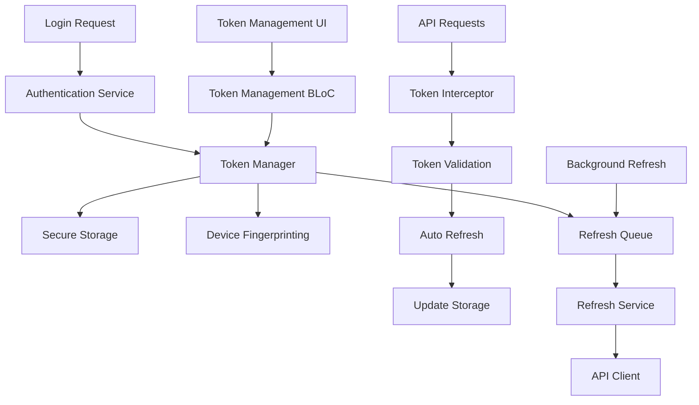

# Token Management Architecture

---

## 📋 **Document Metadata**

| Field | Value |
|-------|-------|
| **Document ID** | DOC-ARCHITECTURE-TOKEN-MANAGEMENT |
| **Version** | 1.0.0 |
| **Status** | Implemented |
| **Category** | Architecture Documentation |
| **Priority** | High |
| **Created Date** | November 23, 2025 |
| **Last Updated** | November 23, 2025 |
| **Next Review** | December 23, 2025 |
| **Author** | Mobile Development Team |
| **Reviewers** | Tech Lead, Architecture Team |
| **Stakeholders** | Development Team, Product Management |

---

## 🎯 **Purpose**

Dokumen ini mendeskripsikan arsitektur dan implementasi Token Management pada aplikasi mobile Usago, termasuk secure storage, automatic refresh, device fingerprinting, dan UI components untuk manajemen token.

---

## Executive Summary

Token Management telah diimplementasikan dengan arsitektur yang komprehensif menggunakan Flutter Secure Storage, device fingerprinting, automatic refresh dengan queue management, dan UI components yang user-friendly. Implementasi ini memastikan keamanan token dan user experience yang optimal.

## 1. Architecture Overview

### 1.1 High-Level Architecture



### 1.2 Core Components

1. **TokenManager**: Central service untuk token management
2. **SecureStorageService**: Secure storage implementation
3. **DeviceFingerprintingService**: Device identification
4. **TokenRefreshQueue**: Queue management untuk refresh requests
5. **TokenManagementBloc**: State management untuk UI
6. **TokenInterceptor**: HTTP interceptor untuk automatic token injection

## 2. Token Manager Implementation

### 2.1 Core Token Manager

```dart
// lib/core/services/token_manager.dart
class TokenManager {
  final SecureStorageService _secureStorage;
  final DeviceFingerprintingService _deviceFingerprinting;
  final TokenRefreshQueue _refreshQueue;
  final AppLogger _logger;

  TokenManager({
    required SecureStorageService secureStorage,
    required DeviceFingerprintingService deviceFingerprinting,
    required TokenRefreshQueue refreshQueue,
    required AppLogger logger,
  }) : _secureStorage = secureStorage,
       _deviceFingerprinting = deviceFingerprinting,
       _refreshQueue = refreshQueue,
       _logger = logger;

  /// Save tokens dengan device fingerprinting
  Future<Either<Failure, void>> saveTokens({
    required String accessToken,
    required String refreshToken,
    required DateTime expiresAt,
  }) async {
    try {
      _logger.info('Saving tokens with device fingerprinting');

      final deviceId = await _deviceFingerprinting.getDeviceId();

      await _secureStorage.saveTokens(
        accessToken: accessToken,
        refreshToken: refreshToken,
        expiresAt: expiresAt,
        deviceId: deviceId,
      );

      _logger.info('Tokens saved successfully for device: $deviceId');
      return const Right(null);
    } catch (e) {
      _logger.error('Failed to save tokens: $e');
      return Left(TokenFailure(message: 'Failed to save tokens: ${e.toString()}'));
    }
  }

  /// Get access token dengan automatic refresh
  Future<Either<Failure, String>> getAccessToken() async {
    try {
      _logger.info('Getting access token');

      final tokens = await _secureStorage.getTokens();

      if (tokens == null) {
        return const Left(TokenFailure(message: 'No tokens found'));
      }

      // Check if token is expired
      if (_isTokenExpired(tokens.expiresAt)) {
        _logger.info('Token expired, initiating refresh');
        return await _refreshAccessToken(tokens.refreshToken);
      }

      _logger.info('Access token retrieved successfully');
      return Right(tokens.accessToken);
    } catch (e) {
      _logger.error('Failed to get access token: $e');
      return Left(TokenFailure(message: 'Failed to get access token: ${e.toString()}'));
    }
  }

  /// Refresh access token
  Future<Either<Failure, String>> _refreshAccessToken(String refreshToken) async {
    try {
      _logger.info('Refreshing access token');

      final result = await _refreshQueue.addToQueue(refreshToken);

      return result.fold(
        (failure) {
          _logger.error('Failed to refresh access token: $failure');
          return Left(failure);
        },
        (newAccessToken) {
          _logger.info('Access token refreshed successfully');
          return Right(newAccessToken);
        },
      );
    } catch (e) {
      _logger.error('Error refreshing access token: $e');
      return Left(TokenFailure(message: 'Error refreshing access token: ${e.toString()}'));
    }
  }

  /// Check if user is authenticated
  Future<bool> isAuthenticated() async {
    try {
      final tokens = await _secureStorage.getTokens();
      return tokens != null && !_isTokenExpired(tokens.expiresAt);
    } catch (e) {
      _logger.error('Error checking authentication status: $e');
      return false;
    }
  }

  /// Logout dan clear tokens
  Future<Either<Failure, void>> logout() async {
    try {
      _logger.info('Logging out and clearing tokens');

      await _secureStorage.clearTokens();
      await _refreshQueue.clearQueue();

      _logger.info('Logout completed successfully');
      return const Right(null);
    } catch (e) {
      _logger.error('Failed to logout: $e');
      return Left(TokenFailure(message: 'Failed to logout: ${e.toString()}'));
    }
  }

  /// Get device info
  Future<DeviceInfo?> getDeviceInfo() async {
    try {
      return await _deviceFingerprinting.getDeviceInfo();
    } catch (e) {
      _logger.error('Failed to get device info: $e');
      return null;
    }
  }

  bool _isTokenExpired(DateTime expiresAt) {
    return DateTime.now().isAfter(expiresAt.subtract(const Duration(minutes: 5)));
  }
}
```

### 2.2 Token Data Model

```dart
// lib/core/models/token_data.dart
class TokenData extends Equatable {
  final String accessToken;
  final String refreshToken;
  final DateTime expiresAt;
  final String deviceId;
  final DateTime createdAt;

  const TokenData({
    required this.accessToken,
    required this.refreshToken,
    required this.expiresAt,
    required this.deviceId,
    required this.createdAt,
  });

  factory TokenData.fromJson(Map<String, dynamic> json) {
    return TokenData(
      accessToken: json['accessToken'] as String,
      refreshToken: json['refreshToken'] as String,
      expiresAt: DateTime.parse(json['expiresAt'] as String),
      deviceId: json['deviceId'] as String,
      createdAt: DateTime.parse(json['createdAt'] as String),
    );
  }

  Map<String, dynamic> toJson() {
    return {
      'accessToken': accessToken,
      'refreshToken': refreshToken,
      'expiresAt': expiresAt.toIso8601String(),
      'deviceId': deviceId,
      'createdAt': createdAt.toIso8601String(),
    };
  }

  bool get isExpired {
    return DateTime.now().isAfter(expiresAt.subtract(const Duration(minutes: 5)));
  }

  bool get needsRefresh {
    return DateTime.now().isAfter(expiresAt.subtract(const Duration(minutes: 15)));
  }

  Duration get timeUntilExpiry {
    final now = DateTime.now();
    if (now.isAfter(expiresAt)) return Duration.zero;
    return expiresAt.difference(now);
  }

  @override
  List<Object?> get props => [accessToken, refreshToken, expiresAt, deviceId, createdAt];

  @override
  String toString() {
    return 'TokenData(deviceId: $deviceId, expiresAt: $expiresAt, isExpired: $isExpired)';
  }
}
```

## 3. Secure Storage Implementation

### 3.1 Secure Storage Service

```dart
// lib/core/services/secure_storage_service.dart
class SecureStorageService {
  static const _accessTokenKey = 'access_token';
  static const _refreshTokenKey = 'refresh_token';
  static const _expiresAtKey = 'expires_at';
  static const _deviceIdKey = 'device_id';
  static const _createdAtKey = 'created_at';

  final FlutterSecureStorage _secureStorage;
  final AppLogger _logger;

  SecureStorageService({
    required FlutterSecureStorage secureStorage,
    required AppLogger logger,
  }) : _secureStorage = secureStorage,
       _logger = logger;

  /// Save tokens ke secure storage
  Future<void> saveTokens({
    required String accessToken,
    required String refreshToken,
    required DateTime expiresAt,
    required String deviceId,
  }) async {
    try {
      _logger.info('Saving tokens to secure storage');

      await _secureStorage.write(
        key: _accessTokenKey,
        value: accessToken,
        aOptions: _getAndroidOptions(),
        iOptions: _getIOSOptions(),
      );

      await _secureStorage.write(
        key: _refreshTokenKey,
        value: refreshToken,
        aOptions: _getAndroidOptions(),
        iOptions: _getIOSOptions(),
      );

      await _secureStorage.write(
        key: _expiresAtKey,
        value: expiresAt.toIso8601String(),
        aOptions: _getAndroidOptions(),
        iOptions: _getIOSOptions(),
      );

      await _secureStorage.write(
        key: _deviceIdKey,
        value: deviceId,
        aOptions: _getAndroidOptions(),
        iOptions: _getIOSOptions(),
      );

      await _secureStorage.write(
        key: _createdAtKey,
        value: DateTime.now().toIso8601String(),
        aOptions: _getAndroidOptions(),
        iOptions: _getIOSOptions(),
      );

      _logger.info('Tokens saved successfully');
    } catch (e) {
      _logger.error('Failed to save tokens: $e');
      rethrow;
    }
  }

  /// Get tokens dari secure storage
  Future<TokenData?> getTokens() async {
    try {
      _logger.info('Retrieving tokens from secure storage');

      final accessToken = await _secureStorage.read(key: _accessTokenKey);
      final refreshToken = await _secureStorage.read(key: _refreshTokenKey);
      final expiresAtString = await _secureStorage.read(key: _expiresAtKey);
      final deviceId = await _secureStorage.read(key: _deviceIdKey);
      final createdAtString = await _secureStorage.read(key: _createdAtKey);

      if (accessToken == null ||
          refreshToken == null ||
          expiresAtString == null ||
          deviceId == null ||
          createdAtString == null) {
        _logger.warning('Incomplete token data found');
        return null;
      }

      final tokenData = TokenData(
        accessToken: accessToken,
        refreshToken: refreshToken,
        expiresAt: DateTime.parse(expiresAtString),
        deviceId: deviceId,
        createdAt: DateTime.parse(createdAtString),
      );

      _logger.info('Tokens retrieved successfully');
      return tokenData;
    } catch (e) {
      _logger.error('Failed to retrieve tokens: $e');
      return null;
    }
  }

  /// Clear tokens dari secure storage
  Future<void> clearTokens() async {
    try {
      _logger.info('Clearing tokens from secure storage');

      await Future.wait([
        _secureStorage.delete(key: _accessTokenKey),
        _secureStorage.delete(key: _refreshTokenKey),
        _secureStorage.delete(key: _expiresAtKey),
        _secureStorage.delete(key: _deviceIdKey),
        _secureStorage.delete(key: _createdAtKey),
      ]);

      _logger.info('Tokens cleared successfully');
    } catch (e) {
      _logger.error('Failed to clear tokens: $e');
      rethrow;
    }
  }

  /// Update access token
  Future<void> updateAccessToken(String newAccessToken, DateTime newExpiresAt) async {
    try {
      _logger.info('Updating access token');

      await _secureStorage.write(
        key: _accessTokenKey,
        value: newAccessToken,
        aOptions: _getAndroidOptions(),
        iOptions: _getIOSOptions(),
      );

      await _secureStorage.write(
        key: _expiresAtKey,
        value: newExpiresAt.toIso8601String(),
        aOptions: _getAndroidOptions(),
        iOptions: _getIOSOptions(),
      );

      _logger.info('Access token updated successfully');
    } catch (e) {
      _logger.error('Failed to update access token: $e');
      rethrow;
    }
  }

  AndroidOptions _getAndroidOptions() {
    return const AndroidOptions(
      encryptedSharedPreferences: true,
      keyCipherAlgorithm: KeyCipherAlgorithm.RSA_ECB_OAEPwithSHA_256andMGF1Padding,
      storageCipherAlgorithm: StorageCipherAlgorithm.AES_GCM_NoPadding,
      preferencesKeyPrefix: 'usago_secure_',
      sharedPreferencesName: 'usago_secure_storage',
    );
  }

  IOSOptions _getIOSOptions() {
    return const IOSOptions(
      accessibility: KeychainAccessibility.first_unlock_this_device,
      accountName: 'usago_tokens',
      synchronizable: false,
    );
  }
}
```

## 4. Device Fingerprinting Implementation

### 4.1 Device Fingerprinting Service

```dart
// lib/core/services/device_fingerprinting_service.dart
class DeviceFingerprintingService {
  final DeviceInfoPlugin _deviceInfo;
  final AppLogger _logger;

  DeviceFingerprintingService({
    required DeviceInfoPlugin deviceInfo,
    required AppLogger logger,
  }) : _deviceInfo = deviceInfo,
       _logger = logger;

  /// Get unique device ID
  Future<String> getDeviceId() async {
    try {
      _logger.info('Generating device fingerprint');

      final deviceInfo = await getDeviceInfo();
      final fingerprint = _generateFingerprint(deviceInfo);

      _logger.info('Device fingerprint generated: ${fingerprint.substring(0, 8)}...');
      return fingerprint;
    } catch (e) {
      _logger.error('Failed to generate device fingerprint: $e');
      rethrow;
    }
  }

  /// Get complete device info
  Future<DeviceInfo> getDeviceInfo() async {
    try {
      _logger.info('Collecting device information');

      if (Platform.isAndroid) {
        final androidInfo = await _deviceInfo.androidInfo;
        return DeviceInfo(
          deviceId: androidInfo.id,
          model: androidInfo.model,
          manufacturer: androidInfo.manufacturer,
          brand: androidInfo.brand,
          systemVersion: androidInfo.version.release,
          sdkInt: androidInfo.version.sdkInt,
          isPhysicalDevice: androidInfo.isPhysicalDevice,
          platform: 'Android',
        );
      } else if (Platform.isIOS) {
        final iosInfo = await _deviceInfo.iosInfo;
        return DeviceInfo(
          deviceId: iosInfo.identifierForVendor ?? 'unknown',
          model: iosInfo.model,
          manufacturer: 'Apple',
          brand: 'Apple',
          systemVersion: iosInfo.systemVersion,
          sdkInt: int.tryParse(iosInfo.systemVersion.split('.').first) ?? 0,
          isPhysicalDevice: iosInfo.isPhysicalDevice,
          platform: 'iOS',
        );
      } else {
        throw UnsupportedError('Platform not supported');
      }
    } catch (e) {
      _logger.error('Failed to get device info: $e');
      rethrow;
    }
  }

  /// Generate unique fingerprint from device info
  String _generateFingerprint(DeviceInfo deviceInfo) {
    final data = [
      deviceInfo.deviceId,
      deviceInfo.model,
      deviceInfo.manufacturer,
      deviceInfo.brand,
      deviceInfo.systemVersion,
      deviceInfo.sdkInt.toString(),
      deviceInfo.isPhysicalDevice.toString(),
      deviceInfo.platform,
    ].join('|');

    final bytes = utf8.encode(data);
    final digest = sha256.convert(bytes);
    return digest.toString();
  }

  /// Validate device fingerprint
  Future<bool> validateDeviceFingerprint(String expectedFingerprint) async {
    try {
      final currentFingerprint = await getDeviceId();
      return currentFingerprint == expectedFingerprint;
    } catch (e) {
      _logger.error('Failed to validate device fingerprint: $e');
      return false;
    }
  }
}

// lib/core/models/device_info.dart
class DeviceInfo extends Equatable {
  final String deviceId;
  final String model;
  final String manufacturer;
  final String brand;
  final String systemVersion;
  final int sdkInt;
  final bool isPhysicalDevice;
  final String platform;

  const DeviceInfo({
    required this.deviceId,
    required this.model,
    required this.manufacturer,
    required this.brand,
    required this.systemVersion,
    required this.sdkInt,
    required this.isPhysicalDevice,
    required this.platform,
  });

  Map<String, dynamic> toJson() {
    return {
      'deviceId': deviceId,
      'model': model,
      'manufacturer': manufacturer,
      'brand': brand,
      'systemVersion': systemVersion,
      'sdkInt': sdkInt,
      'isPhysicalDevice': isPhysicalDevice,
      'platform': platform,
    };
  }

  @override
  List<Object?> get props => [
    deviceId,
    model,
    manufacturer,
    brand,
    systemVersion,
    sdkInt,
    isPhysicalDevice,
    platform,
  ];

  @override
  String toString() {
    return 'DeviceInfo($platform $brand $model, SDK $sdkInt)';
  }
}
```

## 5. Token Refresh Queue Implementation

### 5.1 Refresh Queue Service

```dart
// lib/core/services/token_refresh_queue.dart
class TokenRefreshQueue {
  final DioClient _dioClient;
  final SecureStorageService _secureStorage;
  final AppLogger _logger;
  final Queue<Completer<String>> _refreshQueue = Queue();
  bool _isRefreshing = false;

  TokenRefreshQueue({
    required DioClient dioClient,
    required SecureStorageService secureStorage,
    required AppLogger logger,
  }) : _dioClient = dioClient,
       _secureStorage = secureStorage,
       _logger = logger;

  /// Add refresh request to queue
  Future<Either<Failure, String>> addToQueue(String refreshToken) async {
    try {
      _logger.info('Adding refresh request to queue');

      if (_isRefreshing) {
        _logger.info('Refresh already in progress, waiting for completion');
        final completer = Completer<String>();
        _refreshQueue.add(completer);
        final result = await completer.future;
        return Right(result);
      }

      return await _performRefresh(refreshToken);
    } catch (e) {
      _logger.error('Failed to add refresh request to queue: $e');
      return Left(TokenFailure(message: 'Failed to refresh token: ${e.toString()}'));
    }
  }

  /// Perform actual token refresh
  Future<Either<Failure, String>> _performRefresh(String refreshToken) async {
    try {
      _isRefreshing = true;
      _logger.info('Performing token refresh');

      final response = await _dioClient.post(
        '/auth/refresh',
        data: {'refreshToken': refreshToken},
        options: Options(
          headers: {'Content-Type': 'application/json'},
          extra: {'skipAuth': true},
        ),
      );

      if (response.statusCode == 200) {
        final newAccessToken = response.data['accessToken'] as String;
        final newExpiresAt = DateTime.parse(response.data['expiresAt'] as String);

        // Update secure storage
        await _secureStorage.updateAccessToken(newAccessToken, newExpiresAt);

        // Complete all waiting requests
        while (_refreshQueue.isNotEmpty) {
          final completer = _refreshQueue.removeFirst();
          completer.complete(newAccessToken);
        }

        _logger.info('Token refresh completed successfully');
        return Right(newAccessToken);
      } else {
        final error = response.data['message'] ?? 'Refresh failed';
        _logger.error('Token refresh failed: $error');

        // Complete all waiting requests with error
        while (_refreshQueue.isNotEmpty) {
          final completer = _refreshQueue.removeFirst();
          completer.completeError(error);
        }

        return Left(TokenFailure(message: error));
      }
    } catch (e) {
      _logger.error('Error during token refresh: $e');

      // Complete all waiting requests with error
      while (_refreshQueue.isNotEmpty) {
        final completer = _refreshQueue.removeFirst();
        completer.completeError(e);
      }

      return Left(TokenFailure(message: 'Token refresh failed: ${e.toString()}'));
    } finally {
      _isRefreshing = false;
    }
  }

  /// Clear the refresh queue
  Future<void> clearQueue() async {
    try {
      _logger.info('Clearing token refresh queue');

      while (_refreshQueue.isNotEmpty) {
        final completer = _refreshQueue.removeFirst();
        if (!completer.isCompleted) {
          completer.completeError('Queue cleared');
        }
      }

      _isRefreshing = false;
      _logger.info('Token refresh queue cleared');
    } catch (e) {
      _logger.error('Failed to clear refresh queue: $e');
    }
  }

  /// Check if refresh is in progress
  bool get isRefreshing => _isRefreshing;

  /// Get queue size
  int get queueSize => _refreshQueue.length;
}
```

## 6. Token Management BLoC

### 6.1 Token Management BLoC Implementation

```dart
// lib/features/auth/presentation/bloc/token_management_bloc.dart
class TokenManagementBloc extends Bloc<TokenManagementEvent, TokenManagementState> {
  final TokenManager _tokenManager;
  final AppLogger _logger;

  TokenManagementBloc({
    required TokenManager tokenManager,
    required AppLogger logger,
  }) : _tokenManager = tokenManager,
       _logger = logger,
       super(const TokenManagementInitial()) {
    on<LoadTokenInfoEvent>(_onLoadTokenInfo);
    on<RefreshTokenEvent>(_onRefreshToken);
    on<LogoutEvent>(_onLogout);
    on<LoadDeviceInfoEvent>(_onLoadDeviceInfo);
  }

  Future<void> _onLoadTokenInfo(
    LoadTokenInfoEvent event,
    Emitter<TokenManagementState> emit,
  ) async {
    emit(const TokenManagementLoading());

    try {
      _logger.info('Loading token information');

      final isAuthenticated = await _tokenManager.isAuthenticated();

      if (isAuthenticated) {
        final tokenResult = await _tokenManager.getAccessToken();

        tokenResult.fold(
          (failure) {
            _logger.error('Failed to get access token: $failure');
            emit(TokenManagementError(message: failure.message));
          },
          (accessToken) {
            _logger.info('Token information loaded successfully');
            emit(TokenManagementLoaded(
              isAuthenticated: true,
              accessToken: accessToken,
            ));
          },
        );
      } else {
        _logger.info('User is not authenticated');
        emit(const TokenManagementLoaded(
          isAuthenticated: false,
          accessToken: null,
        ));
      }
    } catch (e) {
      _logger.error('Error loading token information: $e');
      emit(TokenManagementError(message: 'Failed to load token information: ${e.toString()}'));
    }
  }

  Future<void> _onRefreshToken(
    RefreshTokenEvent event,
    Emitter<TokenManagementState> emit,
  ) async {
    emit(const TokenManagementLoading());

    try {
      _logger.info('Refreshing token');

      final tokenResult = await _tokenManager.getAccessToken();

      tokenResult.fold(
        (failure) {
          _logger.error('Failed to refresh token: $failure');
          emit(TokenManagementError(message: failure.message));
        },
        (accessToken) {
          _logger.info('Token refreshed successfully');
          emit(TokenManagementLoaded(
            isAuthenticated: true,
            accessToken: accessToken,
            message: 'Token refreshed successfully',
          ));
        },
      );
    } catch (e) {
      _logger.error('Error refreshing token: $e');
      emit(TokenManagementError(message: 'Failed to refresh token: ${e.toString()}'));
    }
  }

  Future<void> _onLogout(
    LogoutEvent event,
    Emitter<TokenManagementState> emit,
  ) async {
    emit(const TokenManagementLoading());

    try {
      _logger.info('Logging out');

      final logoutResult = await _tokenManager.logout();

      logoutResult.fold(
        (failure) {
          _logger.error('Failed to logout: $failure');
          emit(TokenManagementError(message: failure.message));
        },
        (_) {
          _logger.info('Logout completed successfully');
          emit(const TokenManagementLoggedOut(
            message: 'Logged out successfully',
          ));
        },
      );
    } catch (e) {
      _logger.error('Error during logout: $e');
      emit(TokenManagementError(message: 'Failed to logout: ${e.toString()}'));
    }
  }

  Future<void> _onLoadDeviceInfo(
    LoadDeviceInfoEvent event,
    Emitter<TokenManagementState> emit,
  ) async {
    emit(const TokenManagementLoading());

    try {
      _logger.info('Loading device information');

      final deviceInfo = await _tokenManager.getDeviceInfo();

      if (deviceInfo != null) {
        _logger.info('Device information loaded successfully');
        emit(TokenManagementDeviceInfoLoaded(deviceInfo: deviceInfo));
      } else {
        _logger.warning('Failed to load device information');
        emit(const TokenManagementError(
          message: 'Failed to load device information',
        ));
      }
    } catch (e) {
      _logger.error('Error loading device information: $e');
      emit(TokenManagementError(
        message: 'Failed to load device information: ${e.toString()}',
      ));
    }
  }
}
```

### 6.2 Token Management Events

```dart
// lib/features/auth/presentation/bloc/token_management_event.dart
abstract class TokenManagementEvent extends Equatable {
  const TokenManagementEvent();
}

class LoadTokenInfoEvent extends TokenManagementEvent {
  const LoadTokenInfoEvent();

  @override
  List<Object?> get props => [];
}

class RefreshTokenEvent extends TokenManagementEvent {
  const RefreshTokenEvent();

  @override
  List<Object?> get props => [];
}

class LogoutEvent extends TokenManagementEvent {
  const LogoutEvent();

  @override
  List<Object?> get props => [];
}

class LoadDeviceInfoEvent extends TokenManagementEvent {
  const LoadDeviceInfoEvent();

  @override
  List<Object?> get props => [];
}
```

### 6.3 Token Management States

```dart
// lib/features/auth/presentation/bloc/token_management_state.dart
abstract class TokenManagementState extends Equatable {
  const TokenManagementState();
}

class TokenManagementInitial extends TokenManagementState {
  const TokenManagementInitial();

  @override
  List<Object?> get props => [];
}

class TokenManagementLoading extends TokenManagementState {
  const TokenManagementLoading();

  @override
  List<Object?> get props => [];
}

class TokenManagementLoaded extends TokenManagementState {
  final bool isAuthenticated;
  final String? accessToken;
  final String? message;

  const TokenManagementLoaded({
    required this.isAuthenticated,
    this.accessToken,
    this.message,
  });

  @override
  List<Object?> get props => [isAuthenticated, accessToken, message];
}

class TokenManagementDeviceInfoLoaded extends TokenManagementState {
  final DeviceInfo deviceInfo;

  const TokenManagementDeviceInfoLoaded({required this.deviceInfo});

  @override
  List<Object?> get props => [deviceInfo];
}

class TokenManagementLoggedOut extends TokenManagementState {
  final String message;

  const TokenManagementLoggedOut({required this.message});

  @override
  List<Object?> get props => [message];
}

class TokenManagementError extends TokenManagementState {
  final String message;

  const TokenManagementError({required this.message});

  @override
  List<Object?> get props => [message];
}
```

## 7. HTTP Interceptor Implementation

### 7.1 Token Interceptor

```dart
// lib/core/interceptors/token_interceptor.dart
class TokenInterceptor extends Interceptor {
  final TokenManager _tokenManager;
  final AppLogger _logger;

  TokenInterceptor({
    required TokenManager tokenManager,
    required AppLogger logger,
  }) : _tokenManager = tokenManager,
       _logger = logger;

  @override
  void onRequest(RequestOptions options, RequestInterceptorHandler handler) async {
    try {
      // Skip token injection for auth endpoints
      if (_isAuthEndpoint(options.path)) {
        _logger.debug('Skipping token injection for auth endpoint: ${options.path}');
        handler.next(options);
        return;
      }

      _logger.debug('Injecting token for request: ${options.path}');

      final tokenResult = await _tokenManager.getAccessToken();

      tokenResult.fold(
        (failure) {
          _logger.error('Failed to get access token: $failure');
          handler.reject(DioException(
            requestOptions: options,
            error: failure,
            type: DioExceptionType.unknown,
          ));
        },
        (accessToken) {
          options.headers['Authorization'] = 'Bearer $accessToken';
          _logger.debug('Token injected successfully');
          handler.next(options);
        },
      );
    } catch (e) {
      _logger.error('Error in token interceptor: $e');
      handler.reject(DioException(
        requestOptions: options,
        error: e,
        type: DioExceptionType.unknown,
      ));
    }
  }

  @override
  void onError(DioException err, ErrorInterceptorHandler handler) async {
    try {
      // Handle 401 Unauthorized
      if (err.response?.statusCode == 401) {
        _logger.info('Received 401, attempting token refresh');

        final tokenResult = await _tokenManager.getAccessToken();

        tokenResult.fold(
          (failure) {
            _logger.error('Token refresh failed: $failure');
            handler.next(err);
          },
          (newAccessToken) {
            _logger.info('Token refreshed successfully, retrying request');

            // Clone the original request with new token
            final newOptions = err.requestOptions;
            newOptions.headers['Authorization'] = 'Bearer $newAccessToken';

            // Retry the request
            handler.resolve(
              DioException(
                requestOptions: newOptions,
                response: err.response,
                type: DioExceptionType.unknown,
              ),
            );
          },
        );
      } else {
        handler.next(err);
      }
    } catch (e) {
      _logger.error('Error in error interceptor: $e');
      handler.next(err);
    }
  }

  bool _isAuthEndpoint(String path) {
    final authEndpoints = ['/auth/login', '/auth/register', '/auth/refresh'];
    return authEndpoints.any((endpoint) => path.contains(endpoint));
  }
}
```

## 8. UI Implementation

### 8.1 Token Management Page

```dart
// lib/features/auth/presentation/pages/token_management_page.dart
class TokenManagementPage extends StatelessWidget {
  const TokenManagementPage({super.key});

  @override
  Widget build(BuildContext context) {
    return BlocProvider(
      create: (context) => getIt<TokenManagementBloc>(),
      child: const TokenManagementView(),
    );
  }
}

class TokenManagementView extends StatefulWidget {
  const TokenManagementView({super.key});

  @override
  State<TokenManagementView> createState() => _TokenManagementViewState();
}

class _TokenManagementViewState extends State<TokenManagementView> {
  @override
  void initState() {
    super.initState();
    context.read<TokenManagementBloc>().add(const LoadTokenInfoEvent());
  }

  @override
  Widget build(BuildContext context) {
    return Scaffold(
      appBar: AppBar(
        title: const Text('Token Management'),
        backgroundColor: Theme.of(context).colorScheme.inversePrimary,
      ),
      body: BlocConsumer<TokenManagementBloc, TokenManagementState>(
        listener: (context, state) {
          if (state is TokenManagementError) {
            ScaffoldMessenger.of(context).showSnackBar(
              SnackBar(
                content: Text(state.message),
                backgroundColor: Colors.red,
              ),
            );
          } else if (state is TokenManagementLoggedOut) {
            ScaffoldMessenger.of(context).showSnackBar(
              SnackBar(
                content: Text(state.message),
                backgroundColor: Colors.green,
              ),
            );
            Navigator.of(context).pushAndRemoveUntil(
              MaterialPageRoute(builder: (context) => const LoginPage()),
              (route) => false,
            );
          } else if (state is TokenManagementLoaded && state.message != null) {
            ScaffoldMessenger.of(context).showSnackBar(
              SnackBar(
                content: Text(state.message!),
                backgroundColor: Colors.green,
              ),
            );
          }
        },
        builder: (context, state) {
          if (state is TokenManagementLoading) {
            return const Center(
              child: CircularProgressIndicator(),
            );
          }

          if (state is TokenManagementError) {
            return Center(
              child: Column(
                mainAxisAlignment: MainAxisAlignment.center,
                children: [
                  const Icon(
                    Icons.error_outline,
                    size: 64,
                    color: Colors.red,
                  ),
                  const SizedBox(height: 16),
                  Text(
                    'Error',
                    style: Theme.of(context).textTheme.headlineSmall,
                  ),
                  const SizedBox(height: 8),
                  Text(
                    state.message,
                    style: Theme.of(context).textTheme.bodyMedium,
                    textAlign: TextAlign.center,
                  ),
                  const SizedBox(height: 24),
                  ElevatedButton(
                    onPressed: () {
                      context.read<TokenManagementBloc>().add(const LoadTokenInfoEvent());
                    },
                    child: const Text('Retry'),
                  ),
                ],
              ),
            );
          }

          if (state is TokenManagementLoaded) {
            return TokenManagementContent(
              isAuthenticated: state.isAuthenticated,
              accessToken: state.accessToken,
            );
          }

          if (state is TokenManagementDeviceInfoLoaded) {
            return DeviceInfoContent(deviceInfo: state.deviceInfo);
          }

          return const Center(
            child: Text('Unknown state'),
          );
        },
      ),
    );
  }
}
```

### 8.2 Token Management Content

```dart
// lib/features/auth/presentation/widgets/token_management_content.dart
class TokenManagementContent extends StatelessWidget {
  final bool isAuthenticated;
  final String? accessToken;

  const TokenManagementContent({
    super.key,
    required this.isAuthenticated,
    this.accessToken,
  });

  @override
  Widget build(BuildContext context) {
    if (!isAuthenticated) {
      return const Center(
        child: Column(
          mainAxisAlignment: MainAxisAlignment.center,
          children: [
            Icon(
              Icons.logout,
              size: 64,
              color: Colors.grey,
            ),
            SizedBox(height: 16),
            Text(
              'Not Authenticated',
              style: TextStyle(
                fontSize: 18,
                fontWeight: FontWeight.bold,
              ),
            ),
            SizedBox(height: 8),
            Text(
              'Please login to manage tokens',
              style: TextStyle(color: Colors.grey),
            ),
          ],
        ),
      );
    }

    return SingleChildScrollView(
      padding: const EdgeInsets.all(16),
      child: Column(
        crossAxisAlignment: CrossAxisAlignment.start,
        children: [
          Card(
            child: Padding(
              padding: const EdgeInsets.all(16),
              child: Column(
                crossAxisAlignment: CrossAxisAlignment.start,
                children: [
                  Row(
                    children: [
                      const Icon(Icons.check_circle, color: Colors.green),
                      const SizedBox(width: 8),
                      Text(
                        'Authentication Status',
                        style: Theme.of(context).textTheme.titleMedium,
                      ),
                    ],
                  ),
                  const SizedBox(height: 8),
                  const Text(
                    'You are authenticated',
                    style: TextStyle(color: Colors.green),
                  ),
                ],
              ),
            ),
          ),
          const SizedBox(height: 16),
          Card(
            child: Padding(
              padding: const EdgeInsets.all(16),
              child: Column(
                crossAxisAlignment: CrossAxisAlignment.start,
                children: [
                  Text(
                    'Access Token',
                    style: Theme.of(context).textTheme.titleMedium,
                  ),
                  const SizedBox(height: 8),
                  Container(
                    width: double.infinity,
                    padding: const EdgeInsets.all(12),
                    decoration: BoxDecoration(
                      color: Colors.grey[100],
                      borderRadius: BorderRadius.circular(8),
                    ),
                    child: Text(
                      accessToken?.substring(0, 50) ?? 'N/A',
                      style: const TextStyle(
                        fontFamily: 'monospace',
                        fontSize: 12,
                      ),
                    ),
                  ),
                  const SizedBox(height: 8),
                  if (accessToken != null && accessToken!.length > 50)
                    Text(
                      '...and ${accessToken!.length - 50} more characters',
                      style: TextStyle(
                        color: Colors.grey[600],
                        fontSize: 12,
                      ),
                    ),
                ],
              ),
            ),
          ),
          const SizedBox(height: 16),
          Row(
            children: [
              Expanded(
                child: ElevatedButton.icon(
                  onPressed: () {
                    context.read<TokenManagementBloc>().add(const RefreshTokenEvent());
                  },
                  icon: const Icon(Icons.refresh),
                  label: const Text('Refresh Token'),
                ),
              ),
              const SizedBox(width: 16),
              Expanded(
                child: ElevatedButton.icon(
                  onPressed: () {
                    context.read<TokenManagementBloc>().add(const LoadDeviceInfoEvent());
                  },
                  icon: const Icon(Icons.info),
                  label: const Text('Device Info'),
                ),
              ),
            ],
          ),
          const SizedBox(height: 16),
          SizedBox(
            width: double.infinity,
            child: ElevatedButton.icon(
              onPressed: () {
                _showLogoutConfirmation(context);
              },
              icon: const Icon(Icons.logout),
              label: const Text('Logout'),
              style: ElevatedButton.styleFrom(
                backgroundColor: Colors.red,
                foregroundColor: Colors.white,
              ),
            ),
          ),
        ],
      ),
    );
  }

  void _showLogoutConfirmation(BuildContext context) {
    showDialog(
      context: context,
      builder: (context) => AlertDialog(
        title: const Text('Logout'),
        content: const Text('Are you sure you want to logout?'),
        actions: [
          TextButton(
            onPressed: () => Navigator.of(context).pop(),
            child: const Text('Cancel'),
          ),
          TextButton(
            onPressed: () {
              Navigator.of(context).pop();
              context.read<TokenManagementBloc>().add(const LogoutEvent());
            },
            child: const Text('Logout'),
          ),
        ],
      ),
    );
  }
}
```

## 9. Security Considerations

### 9.1 Token Security

1. **Secure Storage**: Menggunakan Flutter Secure Storage dengan encryption
2. **Device Fingerprinting**: Validasi device untuk prevent token theft
3. **Token Expiration**: Automatic refresh sebelum expiration
4. **Queue Management**: Prevent multiple refresh requests

### 9.2 Threat Mitigation

1. **Token Theft**: Device fingerprinting validation
2. **Replay Attacks**: Unique device identification
3. **Man-in-the-Middle**: HTTPS dengan certificate pinning
4. **Storage Attacks**: Encrypted secure storage

## 10. Performance Optimization

### 10.1 Caching Strategy

1. **Token Caching**: In-memory cache untuk frequently used tokens
2. **Refresh Queue**: Batch multiple refresh requests
3. **Background Refresh**: Proactive token refresh

### 10.2 Memory Management

1. **Queue Cleanup**: Clear completed requests
2. **Resource Cleanup**: Proper disposal of resources
3. **Memory Leaks**: Prevent circular references

## 11. Testing Strategy

### 11.1 Unit Tests

```dart
group('TokenManager', () {
  late TokenManager tokenManager;
  late MockSecureStorageService mockSecureStorage;
  late MockDeviceFingerprintingService mockDeviceFingerprinting;
  late MockTokenRefreshQueue mockRefreshQueue;
  late MockAppLogger mockLogger;

  setUp(() {
    mockSecureStorage = MockSecureStorageService();
    mockDeviceFingerprinting = MockDeviceFingerprintingService();
    mockRefreshQueue = MockTokenRefreshQueue();
    mockLogger = MockAppLogger();

    tokenManager = TokenManager(
      secureStorage: mockSecureStorage,
      deviceFingerprinting: mockDeviceFingerprinting,
      refreshQueue: mockRefreshQueue,
      logger: mockLogger,
    );
  });

  test('saves tokens with device fingerprinting', () async {
    // Arrange
    when(mockDeviceFingerprinting.getDeviceId())
        .thenAnswer((_) async => 'test-device-id');

    // Act
    final result = await tokenManager.saveTokens(
      accessToken: 'test-access-token',
      refreshToken: 'test-refresh-token',
      expiresAt: DateTime.now().add(const Duration(hours: 1)),
    );

    // Assert
    expect(result, const Right(null));
    verify(mockSecureStorage.saveTokens(
      accessToken: 'test-access-token',
      refreshToken: 'test-refresh-token',
      expiresAt: any(named: 'expiresAt'),
      deviceId: 'test-device-id',
    )).called(1);
  });
});
```

### 11.2 Integration Tests

```dart
group('Token Management Integration', () {
  testWidgets('complete token flow', (tester) async {
    // Arrange
    final mockTokenManager = MockTokenManager();
    when(mockManager.isAuthenticated()).thenAnswer((_) async => true);
    when(mockManager.getAccessToken())
        .thenAnswer((_) async => Right('test-token'));

    // Act
    await tester.pumpWidget(
      MaterialApp(
        home: BlocProvider(
          create: (context) => TokenManagementBloc(
            tokenManager: mockTokenManager,
            logger: MockAppLogger(),
          ),
          child: const TokenManagementPage(),
        ),
      ),
    );

    // Assert
    expect(find.text('Authentication Status'), findsOneWidget);
    expect(find.text('You are authenticated'), findsOneWidget);
  });
});
```

## 12. Troubleshooting

### 12.1 Common Issues

#### Issue: Token not refreshing automatically
**Solution**: Check token expiration logic and refresh queue implementation

#### Issue: Device fingerprint mismatch
**Solution**: Validate device info collection and fingerprint generation

#### Issue: Secure storage access denied
**Solution**: Check app permissions and secure storage configuration

### 12.2 Debugging Tools

1. **Logging**: Comprehensive logging for all token operations
2. **Token Inspector**: Debug UI for token inspection
3. **Device Info Viewer**: Tool for device fingerprint debugging

## 13. Future Enhancements

### 13.1 Planned Features

1. **Biometric Authentication**: Add biometric for sensitive operations
2. **Token Rotation**: Implement automatic token rotation
3. **Multi-Device Support**: Manage tokens across multiple devices
4. **Offline Support**: Enhanced offline token management

### 13.2 Performance Improvements

1. **Lazy Loading**: Load token info on demand
2. **Background Sync**: Background token synchronization
3. **Smart Refresh**: Predictive token refresh

## 14. Conclusion

Token Management architecture telah diimplementasikan dengan comprehensive security features, automatic refresh capabilities, dan user-friendly UI. Implementasi ini memastikan keamanan token sambil memberikan user experience yang optimal.

Key achievements:
1. **Secure Storage**: Encrypted token storage dengan device fingerprinting
2. **Automatic Refresh**: Queue-based token refresh dengan collision prevention
3. **User Interface**: Comprehensive UI untuk token management
4. **Error Handling**: Robust error handling dan recovery mechanisms
5. **Testing**: Comprehensive unit dan integration tests

---

**Architecture Version**: 1.0.0
**Implementation Status**: ✅ Complete
**Last Updated**: November 23, 2025
**Next Review**: December 23, 2025