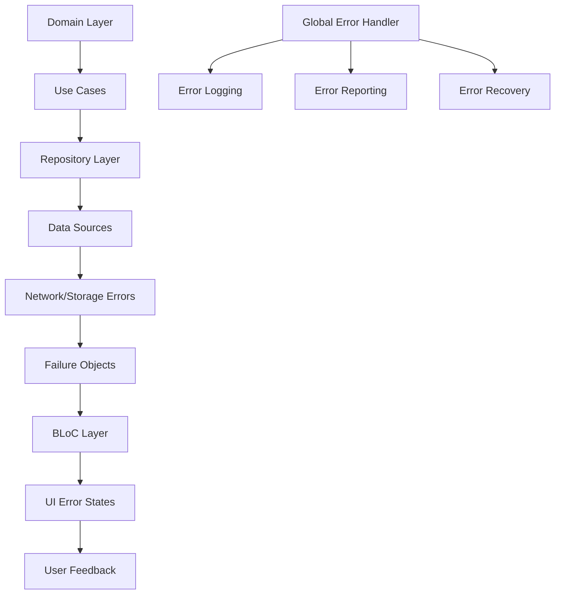

# Error Handling Patterns

---

## 📋 **Document Metadata**

| Field | Value |
|-------|-------|
| **Document ID** | DOC-DEV-ERROR-HANDLING |
| **Version** | 1.0.0 |
| **Status** | Ready for Implementation |
| **Category** | Development Guide |
| **Priority** | High |
| **Created Date** | November 23, 2025 |
| **Last Updated** | November 23, 2025 |
| **Next Review** | December 23, 2025 |
| **Author** | Mobile Development Team |
| **Reviewers** | Tech Lead, Architecture Team |
| **Stakeholders** | Development Team, QA Team |

---

## 🎯 **Purpose**

Dokumen ini menyediakan panduan komprehensif untuk implementasi error handling patterns pada aplikasi mobile Usago, termasuk failure hierarchy, error recovery strategies, dan user experience considerations.

---

## Executive Summary

Error handling adalah critical component untuk user experience dan application stability. Dokumen ini mendefinisikan standardized error handling patterns yang konsisten across semua layers aplikasi, dari domain layer hingga presentation layer.

## 1. Error Handling Architecture

### 1.1 Error Handling Flow



### 1.2 Error Categories

| Category | Description | Examples | Handling Strategy |
|----------|-------------|-----------|------------------|
| **Validation Errors** | Input validation failures | Invalid email, empty field | Immediate UI feedback |
| **Network Errors** | Connectivity issues | No internet, timeout | Retry mechanism |
| **Server Errors** | API response errors | 401, 500, 503 | User notification |
| **Business Logic Errors** | Domain rule violations | Insufficient permissions | Clear error messages |
| **System Errors** | Platform/system failures | Out of memory, storage full | Graceful degradation |
| **Authentication Errors** | Auth/authorization failures | Invalid token, expired | Re-authentication flow |

## 2. Failure Hierarchy

### 2.1 Base Failure Class

```dart
// lib/core/errors/failure.dart
import 'package:equatable/equatable.dart';

abstract class Failure extends Equatable {
  final String message;
  final String? code;
  final dynamic originalError;
  final StackTrace? stackTrace;

  const Failure({
    required this.message,
    this.code,
    this.originalError,
    this.stackTrace,
  });

  @override
  List<Object?> get props => [message, code, originalError];

  @override
  String toString() {
    return 'Failure(message: $message, code: $code)';
  }
}
```

### 2.2 Specific Failure Types

```dart
// lib/core/errors/failures.dart
import 'failure.dart';

// Validation Errors
class ValidationFailure extends Failure {
  const ValidationFailure({
    required String message,
    String? code,
  }) : super(message: message, code: code);
}

// Network Errors
class NetworkFailure extends Failure {
  final int? statusCode;

  const NetworkFailure({
    required String message,
    this.statusCode,
    String? code,
  }) : super(message: message, code: code);
}

class TimeoutFailure extends NetworkFailure {
  const TimeoutFailure({
    required String message,
    String? code,
  }) : super(message: message, code: code);
}

class NoInternetFailure extends NetworkFailure {
  const NoInternetFailure({
    required String message,
    String? code,
  }) : super(message: message, code: code);
}

// Server Errors
class ServerFailure extends Failure {
  final int? statusCode;
  final Map<String, dynamic>? responseData;

  const ServerFailure({
    required String message,
    this.statusCode,
    this.responseData,
    String? code,
  }) : super(message: message, code: code);
}

class UnauthorizedFailure extends ServerFailure {
  const UnauthorizedFailure({
    required String message,
    Map<String, dynamic>? responseData,
  }) : super(
    message: message,
    statusCode: 401,
    responseData: responseData,
    code: 'UNAUTHORIZED',
  );
}

class ForbiddenFailure extends ServerFailure {
  const ForbiddenFailure({
    required String message,
    Map<String, dynamic>? responseData,
  }) : super(
    message: message,
    statusCode: 403,
    responseData: responseData,
    code: 'FORBIDDEN',
  );
}

class NotFoundFailure extends ServerFailure {
  const NotFoundFailure({
    required String message,
    Map<String, dynamic>? responseData,
  }) : super(
    message: message,
    statusCode: 404,
    responseData: responseData,
    code: 'NOT_FOUND',
  );
}

class ServerErrorFailure extends ServerFailure {
  const ServerErrorFailure({
    required String message,
    int? statusCode,
    Map<String, dynamic>? responseData,
  }) : super(
    message: message,
    statusCode: statusCode ?? 500,
    responseData: responseData,
    code: 'SERVER_ERROR',
  );
}

// Business Logic Errors
class BusinessLogicFailure extends Failure {
  const BusinessLogicFailure({
    required String message,
    String? code,
  }) : super(message: message, code: code);
}

class InsufficientPermissionFailure extends BusinessLogicFailure {
  const InsufficientPermissionFailure({
    required String message,
  }) : super(
    message: message,
    code: 'INSUFFICIENT_PERMISSION',
  );
}

class ResourceNotFoundFailure extends BusinessLogicFailure {
  final String resourceType;
  final String resourceId;

  const ResourceNotFoundFailure({
    required this.resourceType,
    required this.resourceId,
  }) : super(
    message: '$resourceType with ID $resourceId not found',
    code: 'RESOURCE_NOT_FOUND',
  );
}

// System Errors
class SystemFailure extends Failure {
  const SystemFailure({
    required String message,
    String? code,
  }) : super(message: message, code: code);
}

class StorageFailure extends SystemFailure {
  const StorageFailure({
    required String message,
    String? code,
  }) : super(message: message, code: code);
}

class MemoryFailure extends SystemFailure {
  const MemoryFailure({
    required String message,
    String? code,
  }) : super(message: message, code: code);
}

// Authentication Errors
class AuthenticationFailure extends Failure {
  const AuthenticationFailure({
    required String message,
    String? code,
  }) : super(message: message, code: code);
}

class TokenExpiredFailure extends AuthenticationFailure {
  const TokenExpiredFailure({
    required String message,
  }) : super(
    message: message,
    code: 'TOKEN_EXPIRED',
  );
}

class InvalidCredentialsFailure extends AuthenticationFailure {
  const InvalidCredentialsFailure({
    required String message,
  }) : super(
    message: message,
    code: 'INVALID_CREDENTIALS',
  );
}

class AccountLockedException extends AuthenticationFailure {
  final DateTime? lockUntil;

  const AccountLockedException({
    required String message,
    this.lockUntil,
  }) : super(
    message: message,
    code: 'ACCOUNT_LOCKED',
  );
}
```

## 3. Error Handling in Use Cases

### 3.1 Standard Use Case Error Handling

```dart
// lib/features/auth/domain/usecases/login_usecase.dart
import 'package:fpdart/fpdart.dart';
import '../../../../core/errors/failure.dart';
import '../repositories/auth_repository.dart';
import '../entities/user.dart';

class LoginParams {
  final String email;
  final String password;

  const LoginParams({
    required this.email,
    required this.password,
  });
}

class LoginUseCase {
  final AuthRepository _repository;
  final AppLogger _logger;

  LoginUseCase({
    required AuthRepository repository,
    required AppLogger logger,
  }) : _repository = repository,
       _logger = logger;

  Future<Either<Failure, User>> call(LoginParams params) async {
    try {
      _logger.info('Attempting login for email: ${params.email}');

      // Input validation
      final validationFailure = _validateInput(params);
      if (validationFailure != null) {
        _logger.warning('Login validation failed: ${validationFailure.message}');
        return Left(validationFailure);
      }

      // Delegate to repository
      final result = await _repository.login(
        email: params.email,
        password: params.password,
      );

      return result.fold(
        (failure) {
          _logger.error('Login failed: ${failure.message}', failure.originalError);
          return Left(_mapRepositoryFailure(failure));
        },
        (user) {
          _logger.info('Login successful for user: ${user.id}');
          return Right(user);
        },
      );
    } catch (e, stackTrace) {
      _logger.error('Unexpected error during login', e, stackTrace);
      return Left(SystemFailure(
        message: 'An unexpected error occurred during login',
        originalError: e,
        stackTrace: stackTrace,
      ));
    }
  }

  ValidationFailure? _validateInput(LoginParams params) {
    if (params.email.isEmpty) {
      return const ValidationFailure(message: 'Email is required');
    }

    if (!_isValidEmail(params.email)) {
      return const ValidationFailure(message: 'Invalid email format');
    }

    if (params.password.isEmpty) {
      return const ValidationFailure(message: 'Password is required');
    }

    if (params.password.length < 6) {
      return const ValidationFailure(message: 'Password must be at least 6 characters');
    }

    return null;
  }

  bool _isValidEmail(String email) {
    return RegExp(r'^[^\s@]+@[^\s@]+\.[^\s@]+$').hasMatch(email);
  }

  Failure _mapRepositoryFailure(Failure repositoryFailure) {
    // Map repository-specific failures to domain failures
    if (repositoryFailure is UnauthorizedFailure) {
      return const InvalidCredentialsFailure(
        message: 'Invalid email or password',
      );
    }

    if (repositoryFailure is NetworkFailure) {
      return repositoryFailure; // Pass through network failures
    }

    if (repositoryFailure is ServerFailure) {
      return repositoryFailure; // Pass through server failures
    }

    return repositoryFailure; // Default: pass through
  }
}
```

### 3.2 Repository Error Handling

```dart
// lib/features/brand/data/repositories/brand_repository_impl.dart
import 'package:fpdart/fpdart.dart';
import '../../../../core/errors/failure.dart';
import '../../domain/entities/brand.dart';
import '../../domain/repositories/brand_repository.dart';
import '../datasources/brand_remote_datasource.dart';
import '../datasources/brand_local_datasource.dart';

class BrandRepositoryImpl implements BrandRepository {
  final BrandRemoteDataSource _remoteDataSource;
  final BrandLocalDataSource _localDataSource;
  final AppLogger _logger;

  BrandRepositoryImpl({
    required BrandRemoteDataSource remoteDataSource,
    required BrandLocalDataSource localDataSource,
    required AppLogger logger,
  }) : _remoteDataSource = remoteDataSource,
       _localDataSource = localDataSource,
       _logger = logger;

  @override
  Future<Either<Failure, List<Brand>>> getUserBrands() async {
    try {
      _logger.info('Getting user brands');

      // Try cache first
      final cachedBrands = await _localDataSource.getUserBrands();
      if (cachedBrands.isNotEmpty) {
        _logger.info('Retrieved ${cachedBrands.length} brands from cache');
        return Right(cachedBrands);
      }

      // Fetch from remote
      final remoteBrands = await _remoteDataSource.getUserBrands();

      // Cache the results
      await _localDataSource.saveUserBrands(remoteBrands);

      _logger.info('Retrieved ${remoteBrands.length} brands from remote');
      return Right(remoteBrands);
    } on NetworkException catch (e) {
      _logger.error('Network error getting user brands', e);
      return Left(NetworkFailure(
        message: 'Network connection failed',
        originalError: e,
      ));
    } on ServerException catch (e) {
      _logger.error('Server error getting user brands', e);
      return Left(ServerFailure(
        message: e.message,
        statusCode: e.statusCode,
        originalError: e,
      ));
    } on StorageException catch (e) {
      _logger.error('Storage error getting user brands', e);
      return Left(StorageFailure(
        message: 'Failed to access local storage',
        originalError: e,
      ));
    } catch (e, stackTrace) {
      _logger.error('Unexpected error getting user brands', e, stackTrace);
      return Left(SystemFailure(
        message: 'An unexpected error occurred',
        originalError: e,
        stackTrace: stackTrace,
      ));
    }
  }

  @override
  Future<Either<Failure, Brand>> createBrand(Brand brand) async {
    try {
      _logger.info('Creating brand: ${brand.name}');

      // Validate business rules
      final businessValidation = _validateBusinessRules(brand);
      if (businessValidation != null) {
        return Left(businessValidation);
      }

      // Create remotely
      final createdBrand = await _remoteDataSource.createBrand(brand);

      // Update cache
      await _localDataSource.saveBrand(createdBrand);

      _logger.info('Brand created successfully: ${createdBrand.id}');
      return Right(createdBrand);
    } on UnauthorizedException catch (e) {
      _logger.error('Unauthorized to create brand', e);
      return const UnauthorizedFailure(
        message: 'You do not have permission to create brands',
      );
    } on ValidationException catch (e) {
      _logger.error('Validation error creating brand', e);
      return Left(ValidationFailure(
        message: e.message,
        originalError: e,
      ));
    } catch (e, stackTrace) {
      _logger.error('Unexpected error creating brand', e, stackTrace);
      return Left(SystemFailure(
        message: 'Failed to create brand',
        originalError: e,
        stackTrace: stackTrace,
      ));
    }
  }

  BusinessLogicFailure? _validateBusinessRules(Brand brand) {
    if (brand.name.isEmpty) {
      return const BusinessLogicFailure(
        message: 'Brand name cannot be empty',
      );
    }

    if (brand.name.length > 100) {
      return const BusinessLogicFailure(
        message: 'Brand name cannot exceed 100 characters',
      );
    }

    // Add more business rules as needed
    return null;
  }
}
```

## 4. BLoC Error Handling

### 4.1 BLoC Error State Management

```dart
// lib/features/brand/presentation/bloc/brand_list_bloc.dart
import 'package:flutter_bloc/flutter_bloc.dart';
import '../../../../core/errors/failure.dart';
import '../../../../core/utils/logger.dart';
import '../../domain/entities/brand.dart';
import '../../domain/usecases/get_user_brands_usecase.dart';
import 'brand_list_event.dart';
import 'brand_list_state.dart';

class BrandListBloc extends Bloc<BrandListEvent, BrandListState> {
  final GetUserBrandsUseCase _getUserBrandsUseCase;
  final AppLogger _logger;

  BrandListBloc({
    required GetUserBrandsUseCase getUserBrandsUseCase,
    required AppLogger logger,
  }) : _getUserBrandsUseCase = getUserBrandsUseCase,
       _logger = logger,
       super(const BrandListInitial()) {
    on<LoadUserBrandsEvent>(_onLoadUserBrands);
    on<RefreshUserBrandsEvent>(_onRefreshUserBrands);
    on<RetryLoadUserBrandsEvent>(_onRetryLoadUserBrands);
  }

  Future<void> _onLoadUserBrands(
    LoadUserBrandsEvent event,
    Emitter<BrandListState> emit,
  ) async {
    emit(const BrandListLoading());

    final result = await _getUserBrandsUseCase(const NoParams());

    result.fold(
      (failure) {
        _logger.error('Failed to load user brands', failure);
        emit(BrandListError(
          message: _getErrorMessage(failure),
          failure: failure,
          canRetry: _canRetry(failure),
        ));
      },
      (brands) {
        _logger.info('Successfully loaded ${brands.length} user brands');
        emit(BrandListLoaded(brands: brands));
      },
    );
  }

  Future<void> _onRefreshUserBrands(
    RefreshUserBrandsEvent event,
    Emitter<BrandListState> emit,
  ) async {
    emit(const BrandListLoading());

    final result = await _getUserBrandsUseCase(const NoParams());

    result.fold(
      (failure) {
        _logger.error('Failed to refresh user brands', failure);
        emit(BrandListError(
          message: _getErrorMessage(failure),
          failure: failure,
          canRetry: _canRetry(failure),
          isRefreshing: true,
        ));
      },
      (brands) {
        _logger.info('Successfully refreshed ${brands.length} user brands');
        emit(BrandListLoaded(brands: brands));
      },
    );
  }

  Future<void> _onRetryLoadUserBrands(
    RetryLoadUserBrandsEvent event,
    Emitter<BrandListState> emit,
  ) async {
    emit(const BrandListLoading());

    final result = await _getUserBrandsUseCase(const NoParams());

    result.fold(
      (failure) {
        _logger.error('Failed to retry loading user brands', failure);
        emit(BrandListError(
          message: _getErrorMessage(failure),
          failure: failure,
          canRetry: _canRetry(failure),
          retryCount: event.retryCount + 1,
        ));
      },
      (brands) {
        _logger.info('Successfully loaded ${brands.length} user brands after retry');
        emit(BrandListLoaded(brands: brands));
      },
    );
  }

  String _getErrorMessage(Failure failure) {
    switch (failure.runtimeType) {
      case NetworkFailure:
        return LocaleSettings.currentLocale == AppLocale.id
            ? 'Tidak ada koneksi internet. Periksa koneksi Anda dan coba lagi.'
            : 'No internet connection. Please check your connection and try again.';
      case ServerFailure:
        final serverFailure = failure as ServerFailure;
        return _getServerErrorMessage(serverFailure);
      case ValidationFailure:
        return failure.message;
      case BusinessLogicFailure:
        return failure.message;
      case SystemFailure:
        return LocaleSettings.currentLocale == AppLocale.id
            ? 'Terjadi kesalahan sistem. Silakan coba lagi.'
            : 'A system error occurred. Please try again.';
      default:
        return failure.message;
    }
  }

  String _getServerErrorMessage(ServerFailure failure) {
    switch (failure.statusCode) {
      case 401:
        return LocaleSettings.currentLocale == AppLocale.id
            ? 'Anda tidak memiliki izin untuk mengakses data ini.'
            : 'You don\'t have permission to access this data.';
      case 403:
        return LocaleSettings.currentLocale == AppLocale.id
            ? 'Akses ditolak. Hubungi administrator.'
            : 'Access denied. Please contact administrator.';
      case 404:
        return LocaleSettings.currentLocale == AppLocale.id
            ? 'Data tidak ditemukan.'
            : 'Data not found.';
      case 429:
        return LocaleSettings.currentLocale == AppLocale.id
            ? 'Terlalu banyak permintaan. Silakan coba lagi nanti.'
            : 'Too many requests. Please try again later.';
      case 500:
        return LocaleSettings.currentLocale == AppLocale.id
            ? 'Kesalahan server internal. Silakan coba lagi.'
            : 'Internal server error. Please try again.';
      case 503:
        return LocaleSettings.currentLocale == AppLocale.id
            ? 'Layanan tidak tersedia. Silakan coba lagi nanti.'
            : 'Service unavailable. Please try again later.';
      default:
        return failure.message;
    }
  }

  bool _canRetry(Failure failure) {
    // Allow retry for network errors and some server errors
    return failure is NetworkFailure ||
           failure is TimeoutFailure ||
           failure is NoInternetFailure ||
           (failure is ServerFailure &&
            (failure.statusCode == 500 || failure.statusCode == 502 || failure.statusCode == 503));
  }
}
```

### 4.2 Error State Classes

```dart
// lib/features/brand/presentation/bloc/brand_list_state.dart
import 'package:equatable/equatable.dart';
import '../../../../core/errors/failure.dart';
import '../../domain/entities/brand.dart';

abstract class BrandListState extends Equatable {
  const BrandListState();
}

class BrandListInitial extends BrandListState {
  const BrandListInitial();

  @override
  List<Object?> get props => [];
}

class BrandListLoading extends BrandListState {
  final bool isRefreshing;

  const BrandListLoading({this.isRefreshing = false});

  @override
  List<Object?> get props => [isRefreshing];
}

class BrandListLoaded extends BrandListState {
  final List<Brand> brands;

  const BrandListLoaded({required this.brands});

  @override
  List<Object?> get props => [brands];
}

class BrandListError extends BrandListState {
  final String message;
  final Failure failure;
  final bool canRetry;
  final bool isRefreshing;
  final int retryCount;

  const BrandListError({
    required this.message,
    required this.failure,
    this.canRetry = false,
    this.isRefreshing = false,
    this.retryCount = 0,
  });

  @override
  List<Object?> get props => [
    message,
    failure,
    canRetry,
    isRefreshing,
    retryCount,
  ];
}
```

## 5. UI Error Handling

### 5.1 Error Widget

```dart
// lib/shared/widgets/error_widget.dart
import 'package:flutter/material.dart';
import '../../../../core/errors/failure.dart';

class ErrorWidget extends StatelessWidget {
  final String message;
  final VoidCallback? onRetry;
  final bool canRetry;
  final IconData? icon;
  final Color? iconColor;

  const ErrorWidget({
    required this.message,
    this.onRetry,
    this.canRetry = false,
    this.icon,
    this.iconColor,
    Key? key,
  }) : super(key: key);

  @override
  Widget build(BuildContext context) {
    return Center(
      child: Padding(
        padding: const EdgeInsets.all(16.0),
        child: Column(
          mainAxisAlignment: MainAxisAlignment.center,
          children: [
            Icon(
              icon ?? Icons.error_outline,
              size: 64,
              color: iconColor ?? Theme.of(context).colorScheme.error,
            ),
            const SizedBox(height: 16),
            Text(
              message,
              textAlign: TextAlign.center,
              style: Theme.of(context).textTheme.bodyLarge?.copyWith(
                color: Theme.of(context).colorScheme.error,
              ),
            ),
            if (canRetry && onRetry != null) ...[
              const SizedBox(height: 24),
              ElevatedButton.icon(
                onPressed: onRetry,
                icon: const Icon(Icons.refresh),
                label: Text(context.t.retry),
                style: ElevatedButton.styleFrom(
                  backgroundColor: Theme.of(context).colorScheme.primary,
                  foregroundColor: Theme.of(context).colorScheme.onPrimary,
                ),
              ),
            ],
          ],
        ),
      ),
    );
  }
}
```

### 5.2 Error Handling in UI

```dart
// lib/features/brand/presentation/pages/brand_list_page.dart
import 'package:flutter/material.dart';
import 'package:flutter_bloc/flutter_bloc.dart';
import '../bloc/brand_list_bloc.dart';
import '../bloc/brand_list_state.dart';
import '../../../../shared/widgets/error_widget.dart';

class BrandListPage extends StatelessWidget {
  const BrandListPage({Key? key}) : super(key: key);

  @override
  Widget build(BuildContext context) {
    return Scaffold(
      appBar: AppBar(
        title: Text(context.t.brands),
        actions: [
          IconButton(
            icon: const Icon(Icons.refresh),
            onPressed: () {
              context.read<BrandListBloc>().add(const RefreshUserBrandsEvent());
            },
          ),
        ],
      ),
      body: BlocConsumer<BrandListBloc, BrandListState>(
        listener: (context, state) {
          // Handle specific error cases
          if (state is BrandListError && state.failure is UnauthorizedFailure) {
            _showUnauthorizedDialog(context);
          }
        },
        builder: (context, state) {
          if (state is BrandListLoading) {
            return const Center(
              child: CircularProgressIndicator(),
            );
          }

          if (state is BrandListLoaded) {
            return _buildBrandList(state.brands);
          }

          if (state is BrandListError) {
            return ErrorWidget(
              message: state.message,
              onRetry: state.canRetry ? () => _retry(context, state.retryCount) : null,
              canRetry: state.canRetry,
              icon: _getErrorIcon(state.failure),
            );
          }

          return const SizedBox.shrink();
        },
      ),
    );
  }

  Widget _buildBrandList(List<Brand> brands) {
    if (brands.isEmpty) {
      return Center(
        child: Column(
          mainAxisAlignment: MainAxisAlignment.center,
          children: [
            const Icon(
              Icons.business_center_outlined,
              size: 64,
              color: Colors.grey,
            ),
            const SizedBox(height: 16),
            Text(
              context.t.noBrandsFound,
              style: const TextStyle(
                fontSize: 18,
                color: Colors.grey,
              ),
            ),
            const SizedBox(height: 16),
            ElevatedButton.icon(
              onPressed: () {
                // Navigate to create brand
              },
              icon: const Icon(Icons.add),
              label: Text(context.t.createBrand),
            ),
          ],
        ),
      );
    }

    return ListView.builder(
      itemCount: brands.length,
      itemBuilder: (context, index) {
        final brand = brands[index];
        return BrandCard(brand: brand);
      },
    );
  }

  void _retry(BuildContext context, int retryCount) {
    if (retryCount >= 3) {
      _showMaxRetryDialog(context);
    } else {
      context.read<BrandListBloc>().add(RetryLoadUserBrandsEvent(retryCount: retryCount));
    }
  }

  void _showUnauthorizedDialog(BuildContext context) {
    showDialog(
      context: context,
      builder: (context) => AlertDialog(
        title: Text(context.t.sessionExpired),
        content: Text(context.t.sessionExpiredMessage),
        actions: [
          TextButton(
            onPressed: () => Navigator.of(context).pop(),
            child: Text(context.t.cancel),
          ),
          TextButton(
            onPressed: () {
              Navigator.of(context).pop();
              // Navigate to login
            },
            child: Text(context.t.login),
          ),
        ],
      ),
    );
  }

  void _showMaxRetryDialog(BuildContext context) {
    showDialog(
      context: context,
      builder: (context) => AlertDialog(
        title: Text(context.t.connectionFailed),
        content: Text(context.t.maxRetryReachedMessage),
        actions: [
          TextButton(
            onPressed: () => Navigator.of(context).pop(),
            child: Text(context.t.ok),
          ),
        ],
      ),
    );
  }

  IconData _getErrorIcon(Failure failure) {
    switch (failure.runtimeType) {
      case NetworkFailure:
        return Icons.wifi_off;
      case ServerFailure:
        return Icons.cloud_off;
      case ValidationFailure:
        return Icons.error_outline;
      case BusinessLogicFailure:
        return Icons.business_center;
      case SystemFailure:
        return Icons.bug_report;
      default:
        return Icons.error_outline;
    }
  }
}
```

## 6. Global Error Handling

### 6.1 Global Error Handler

```dart
// lib/core/error/global_error_handler.dart
import 'package:flutter/material.dart';
import '../errors/failure.dart';
import '../utils/logger.dart';

class GlobalErrorHandler {
  static final GlobalKey<NavigatorState> navigatorKey = GlobalKey<NavigatorState>();
  static final AppLogger _logger = AppLogger();

  static void handleError(Failure failure, {BuildContext? context}) {
    _logger.error('Global error handler: ${failure.message}', failure.originalError);

    // Handle critical errors
    if (failure is SystemFailure) {
      _handleSystemError(failure, context);
    } else if (failure is UnauthorizedFailure) {
      _handleUnauthorizedError(failure, context);
    } else if (failure is NetworkFailure) {
      _handleNetworkError(failure, context);
    }
  }

  static void _handleSystemError(SystemFailure failure, BuildContext? context) {
    _logger.error('System error occurred', failure.originalError);

    // Show user-friendly message
    _showErrorSnackBar(
      context,
      context?.t.systemError ?? 'A system error occurred',
    );
  }

  static void _handleUnauthorizedError(UnauthorizedFailure failure, BuildContext? context) {
    _logger.warning('Unauthorized access attempted');

    // Navigate to login
    _navigateToLogin(context);
  }

  static void _handleNetworkError(NetworkFailure failure, BuildContext? context) {
    _logger.warning('Network error: ${failure.message}');

    // Show network error message
    _showErrorSnackBar(
      context,
      context?.t.networkError ?? 'Network error occurred',
    );
  }

  static void _showErrorSnackBar(BuildContext? context, String message) {
    if (context != null) {
      ScaffoldMessenger.of(context).showSnackBar(
        SnackBar(
          content: Text(message),
          backgroundColor: Colors.red,
          duration: const Duration(seconds: 5),
          action: SnackBarAction(
            label: 'Dismiss',
            onPressed: () {
              ScaffoldMessenger.of(context).hideCurrentSnackBar();
            },
          ),
        ),
      );
    }
  }

  static void _navigateToLogin(BuildContext? context) {
    if (context != null) {
      Navigator.of(context).pushNamedAndRemoveUntil(
        '/login',
        (route) => false,
      );
    }
  }
}
```

### 6.2 Error Boundary

```dart
// lib/core/error/error_boundary.dart
import 'package:flutter/material.dart';
import '../errors/failure.dart';

class ErrorBoundary extends StatefulWidget {
  final Widget child;
  final Widget Function(Failure, void Function())? onError;
  final String? errorTitle;

  const ErrorBoundary({
    required this.child,
    this.onError,
    this.errorTitle,
    Key? key,
  }) : super(key: key);

  @override
  State<ErrorBoundary> createState() => _ErrorBoundaryState();
}

class _ErrorBoundaryState extends State<ErrorBoundary> {
  Failure? _error;

  @override
  void initState() {
    super.initState();
    FlutterError.onError = _handleFlutterError;
  }

  @override
  Widget build(BuildContext context) {
    if (_error != null) {
      return widget.onError?.call(_error!, _clearError) ??
          _buildDefaultError(context, _error!);
    }

    return widget.child;
  }

  void _handleFlutterError(FlutterErrorDetails details) {
    setState(() {
      _error = SystemFailure(
        message: details.exception.toString(),
        originalError: details.exception,
        stackTrace: details.stack,
      );
    });

    // Log to error reporting service
    GlobalErrorHandler.handleError(_error!, context: context);
  }

  Widget _buildDefaultError(BuildContext context, Failure error) {
    return Scaffold(
      appBar: AppBar(
        title: Text(widget.errorTitle ?? 'Error'),
        backgroundColor: Colors.red,
      ),
      body: Center(
        child: Padding(
          padding: const EdgeInsets.all(16.0),
          child: Column(
            mainAxisAlignment: MainAxisAlignment.center,
            children: [
              const Icon(
                Icons.error_outline,
                size: 64,
                color: Colors.red,
              ),
              const SizedBox(height: 16),
              Text(
                error.message,
                textAlign: TextAlign.center,
                style: const TextStyle(fontSize: 16),
              ),
              const SizedBox(height: 24),
              ElevatedButton(
                onPressed: _clearError,
                child: const Text('Try Again'),
              ),
            ],
          ),
        ),
      ),
    );
  }

  void _clearError() {
    setState(() {
      _error = null;
    });
  }
}
```

## 7. Error Reporting and Analytics

### 7.1 Error Reporting Service

```dart
// lib/core/error/error_reporting_service.dart
import 'package:flutter/foundation.dart';
import '../errors/failure.dart';
import '../utils/logger.dart';

class ErrorReportingService {
  static final AppLogger _logger = AppLogger();

  static Future<void> reportError(Failure failure, {Map<String, dynamic>? context}) async {
    if (kReleaseMode) {
      // Only report in release mode
      try {
        // Send to error reporting service (Crashlytics, Sentry, etc.)
        await _sendToErrorService(failure, context);
      } catch (e) {
        _logger.error('Failed to report error', e);
      }
    } else {
      // In debug mode, just log
      _logger.error('Error reported', failure);
    }
  }

  static Future<void> _sendToErrorService(
    Failure failure,
    Map<String, dynamic>? context,
  ) async {
    // Implementation depends on error reporting service
    // Example for Firebase Crashlytics:
    // await FirebaseCrashlytics.instance.recordError(
    //   failure.originalError,
    //   fatal: failure is SystemFailure,
    //   information: [
    //     DiagnosticsProperty('message', failure.message),
    //     DiagnosticsProperty('code', failure.code),
    //     if (context != null) ...context!.entries.map((e) => DiagnosticsProperty(e.key, e.value)),
    //   ],
    // );
  }

  static Future<void> reportCustomEvent(String name, {Map<String, dynamic>? parameters}) async {
    if (kReleaseMode) {
      try {
        // Send custom event to analytics
        await _sendCustomEvent(name, parameters);
      } catch (e) {
        _logger.error('Failed to report custom event', e);
      }
    } else {
      _logger.info('Custom event: $name', parameters);
    }
  }

  static Future<void> _sendCustomEvent(String name, Map<String, dynamic>? parameters) async {
    // Implementation depends on analytics service
    // Example for Firebase Analytics:
    // await FirebaseAnalytics.instance.logEvent(
    //   name: name,
    //   parameters: parameters,
    // );
  }
}
```

## 8. Best Practices

### 8.1 Error Handling Principles

1. **Fail Fast**: Validate input early and fail fast
2. **User-Friendly Messages**: Provide clear, actionable error messages
3. **Consistent Error Types**: Use standardized failure hierarchy
4. **Proper Logging**: Log errors with sufficient context
5. **Graceful Degradation**: Handle errors without crashing the app
6. **Recovery Mechanisms**: Provide retry and recovery options
7. **Error Reporting**: Report errors for monitoring and improvement

### 8.2 Error Message Guidelines

```dart
// Good error messages
const String goodNetworkError = 'Unable to connect. Please check your internet connection.';
const String goodValidationError = 'Email address is required';
const String goodServerError = 'Server is temporarily unavailable. Please try again later.';

// Bad error messages
const String badNetworkError = 'Network error';
const String badValidationError = 'Error';
const String badServerError = '500 Internal Server Error';
```

### 8.3 Error Recovery Strategies

| Error Type | Recovery Strategy | Implementation |
|------------|------------------|----------------|
| **Network Error** | Retry with exponential backoff | Automatic retry in BLoC |
| **Validation Error** | Highlight invalid fields | Form validation in UI |
| **Authentication Error** | Redirect to login | Global error handler |
| **Server Error** | Retry with user confirmation | Retry button in error widget |
| **System Error** | Graceful degradation | Error boundary |

## 9. Testing Error Handling

### 9.1 Unit Testing Error Scenarios

```dart
// test/features/auth/domain/usecases/login_usecase_test.dart
test('returns ValidationFailure when email is invalid', () async {
  // Arrange
  const invalidEmail = 'invalid-email';

  // Act
  final result = await loginUseCase(LoginParams(
    email: invalidEmail,
    password: 'password123',
  ));

  // Assert
  expect(
    result,
    equals(const Left(ValidationFailure(message: 'Invalid email format'))),
  );
});

test('returns NetworkFailure when network fails', () async {
  // Arrange
  when(() => mockRepository.login(any(), any()))
      .thenThrow(NetworkException('No internet'));

  // Act
  final result = await loginUseCase(LoginParams(
    email: 'test@example.com',
    password: 'password123',
  ));

  // Assert
  expect(
    result,
    equals(const Left(NetworkFailure(message: 'Network connection failed'))),
  );
});
```

### 9.2 Widget Testing Error States

```dart
// test/features/auth/presentation/pages/login_page_test.dart
testWidgets('shows error message when login fails', (tester) async {
  // Arrange
  whenListen(mockAuthBloc, const AuthFailure(message: 'Invalid credentials'));

  await tester.pumpWidget(
    MaterialApp(
      home: BlocProvider<AuthBloc>.value(
        value: mockAuthBloc,
        child: const LoginPage(),
      ),
    ),
  );

  // Assert
  expect(find.text('Invalid credentials'), findsOneWidget);
  expect(find.byType(ElevatedButton), findsOneWidget);
});
```

## 10. Conclusion

Error handling patterns yang komprehensif adalah essential untuk aplikasi mobile yang robust dan user-friendly. Dengan mengikuti panduan ini:

1. **Consistent Error Handling**: Standardized failure hierarchy dan error messages
2. **Better User Experience**: Clear error communication dan recovery options
3. **Improved Debugging**: Comprehensive logging dan error reporting
4. **Enhanced Reliability**: Graceful error handling dan recovery mechanisms
5. **Better Testing**: Testable error scenarios dan edge cases

Key takeaways:
- **Use Either Pattern**: Consistent error handling di use cases
- **Implement Failure Hierarchy**: Structured error types untuk better handling
- **Provide Recovery Options**: Retry mechanisms dan user guidance
- **Log Everything**: Comprehensive logging untuk debugging
- **Test Error Scenarios**: Ensure error handling works correctly

---

**Guide Version**: 1.0.0
**Implementation Status**: ✅ Ready for Use
**Last Updated**: November 23, 2025
**Next Review**: December 23, 2025